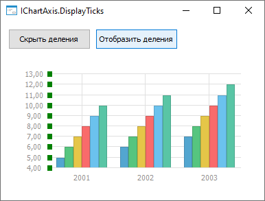
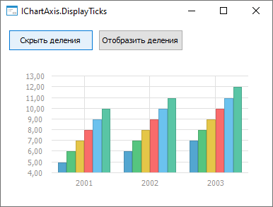

# IChartAxis.DisplayTicks

IChartAxis.DisplayTicks
-

# IChartAxis.DisplayTicks

## Синтаксис

DisplayTicks: Boolean;

## Описание

Свойство DisplayTicks определяет,
 отображаются ли деления осей диаграммы.

## Комментарии

Допустимые значения:

	- True. Деления осей отображаются
	 на диаграмме;

	- False. По умолчанию.
	 Деления осей не отображаются на диаграмме.

## Пример

Для выполнения примера разместите на форме два компонента Button,
 ChartBox и UiErAnalyzer
 с наименованиями BUTTON1, BUTTON2, CHARTBOX1 и UIERANALYZER1 соответственно.
 Для компонента ChartBox установите
 свойству Source значение UiErAnalyzer1.
 Для компонента Button1 установите
 свойству Text значение «Скрыть
 деления», для компонента Button2
 - «Отобразить деления». Для компонента UiErAnalyzer
 установите свойству Active значение
 True. Предполагается наличие экспресс-отчета,
 который указан в качестве свойства Object
 для компонента UiErAnalyzer.

Добавьте ссылки на системные сборки: Chart, Drawing, Express, Forms.

	Sub Button1OnClick(Sender: Object; Args: IMouseEventArgs);

	Var

	    Chart: IChart;

	    ChartAxisY: IChartAxis;

	Begin

	    Chart := ChartBox1.Chart;

	    ChartAxisY := Chart.AxisY;

	    ChartAxisY.DisplayTicks:= False;

	End Sub Button1OnClick;

	Sub Button2OnClick(Sender: Object; Args: IMouseEventArgs);

	Var

	    Chart: IChart;

	    ChartAxisY: IChartAxis;

	    TickPen: IGxPen;

	Begin

	    Chart := ChartBox1.Chart;

	    ChartAxisY := Chart.AxisY;

	    ChartAxisY.DisplayTicks := True;

	    ChartAxisY.TickPen := New GxPen.CreateSolid(GxColor.FromName("Green"),2.0);

	End Sub Button2OnClick;

При нажатии на кнопку «Отобразить деления» деления будут отображены на оси Y:

При нажатии на кнопку «Скрыть деления» деления на оси Y будут скрыты:

См. также:

[IChartAxis](IChartAxis.htm)

		Справочная
		 система на версию 10.9
		 от 18/08/2025,
		 © ООО «ФОРСАЙТ»,
