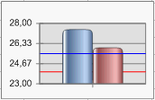

# IChartAxis.LevelLines

IChartAxis.LevelLines
-

# IChartAxis.LevelLines

## Синтаксис

LevelLines: [IChartAxisLevelLines](../IChartAxisLevelLines/IChartAxisLevelLines.htm);

## Описание

Свойство LevelLines определяет
 параметры линии уровня на диаграмме.

## Комментарии

Работа с доступными параметрами осуществляется посредством интерфейса
 [IChartAxisLevelLines](../IChartAxisLevelLine/IChartAxisLevelLine.htm).

## Пример

Данный модуль подключается к регламентному отчету, на листе которого
 расположена диаграмма. На диаграмме должна присутствовать линия уровня.

	Sub Custom;

	Var

	    Chart: IChart;

	Begin

	    Chart := PrxReport.ActiveReport.ActiveSheet.Table.Objects.Item(0).Extension As IChart;

	    Chart.AxisY.LevelLines.Item(0).DrawUnderSeries := True;

	    PrxReport.ActiveReport.ActiveSheet.Recalc;

	End Sub Custom;

После выполнения примера линия уровня на диаграмме будет расположена
 под рядами данных.

Ниже приведен пример уровня расположенного поверх рядов данных (сверху)
 и уровня расположенного под рядами данных (снизу):

См. также:

[IChartAxis](IChartAxis.htm)

		Справочная
		 система на версию 10.9
		 от 18/08/2025,
		 © ООО «ФОРСАЙТ»,
