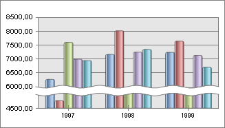

# IChartAxis.MinJointGap

IChartAxis.MinJointGap
-

# IChartAxis.MinJointGap

## Синтаксис

MinJointGap: Double;

## Описание

Свойство MinJointGap устанавливает
 начальное значение точки разрыва оси и рядов диаграммы.

## Комментарии

Значение свойства определяется в пределах от минимального до максимального
 значений по шкале. Актуально для использования только для оси значений
 и если свойство [IChartAxis.UseJointGap](IChartAxis.UseJointGap.htm)
 установлено в True.

## Пример

Для выполнения примера предполагается наличие формы, расположенной на
 ней кнопки с наименованием «Button1»,
 компонентов ReportBox и UiReport, являющегося источником
 данных.

			    Sub Button1OnClick(Sender: Object; Args: IMouseEventArgs);

    Var

        axis: IChartAxis;

        chart: IPrxChart;

    Begin

        chart := (rep.ActiveSheet As IprxTable).TabSheet.Objects.Item(0).Extension As IPrxChart;

        axis := (chart As Ichart).AxisY;

        axis.UseJointGap := True;

        axis.MinJointGap := 5000;

        axis.MaxJointGap := 6000;

    End Sub Button1OnClick;

После выполнения примера для оси значений и рядов диаграммы будут использованы
 разрывы:

См. также:

[IChartAxis](IChartAxis.htm)

		Справочная
		 система на версию 10.9
		 от 18/08/2025,
		 © ООО «ФОРСАЙТ»,
