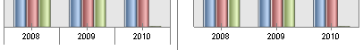

# IChartAxis.ShowCategoryLines

IChartAxis.ShowCategoryLines
-

# IChartAxis.ShowCategoryLines

## Синтаксис

ShowCategoryLines: Boolean;

## Описание

Свойство ShowCategoryLines определяет
 отображение разделительных линий между обозначениями категорий на оси.

## Комментарии

Свойство актуально только для оси категорий (ось X).

По умолчанию свойство имеет значение False
 и разделительные линии не используются. При значении True
 будет включено их отображение. Разделительные линии проходят перпендикулярно
 линии оси между категориями и отображаются соответственно настройкам линий
 делений для оси: цвет, толщина, тип линии и пр.

Слева приведен пример с разделительными линиями (True),
 справа – без них (False):

См. также:

[IChartAxis](IChartAxis.htm)

		Справочная
		 система на версию 10.9
		 от 18/08/2025,
		 © ООО «ФОРСАЙТ»,
