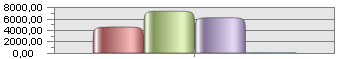

# IChartAxis.TickAlignment

IChartAxis.TickAlignment
-

# IChartAxis.TickAlignment

## Синтаксис

TickAlignment: [ChartAxisTickAlignment](../../Enums/ChartAxisTickAlignment.htm);

## Описание

Свойство TickAlignment определяет расположение делений относительно осей.

## Пример

Для выполнения примера предполагается наличие формы, расположенной на ней кнопки с наименованием «Button1», компонентов ChartBox, UiChart и компонента UiErAnalyzer с наименованием «UiErAnalyzer1», являющегося источником данных.

			Class TESTForm: Form

    Button1: Button;

    UiErAnalyzer1: UiErAnalyzer;

    UiChart1: UiChart;

    ChartBox1: ChartBox;

    Sub Button1OnClick(Sender: Object; Args: IMouseEventArgs);

    Begin

        ChartBox1.Chart.AxisY.MinorTick := True;

        ChartBox1.Chart.AxisY.TickAlignment := 1 As ChartAxisTickAlignment;

    End Sub Button1OnClick;

End Class TESTForm;

После нажатия кнопки «Button1» деления на оси Y будут отображаться целиком снаружи области построения:

См. также:

[IChartAxis](IChartAxis.htm)

		Справочная
		 система на версию 10.9
		 от 18/08/2025,
		 © ООО «ФОРСАЙТ»,
