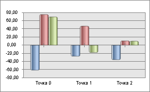

# IChartAxis.TicksOnZeroLine

IChartAxis.TicksOnZeroLine
-

# IChartAxis.TicksOnZeroLine

## Синтаксис

TicksOnZeroLine: Boolean;

## Описание

Свойство TicksOnZeroLine определяет
 отображение делений на нулевой линии.

## Комментарии

Свойство актуально только для оси категорий (ось X). Для использования
 свойства необходимо [включить отображение
 нулевой линии на оси Y](IChartAxis.IncludeZero.htm).

По умолчанию свойство имеет значение False
 и деления отображаются на оси категорий (ось X). При значении True
 деления будут отображены на линии, которая проходит через ноль оси значений
 (ось Y). Если ось значений (Y) содержит минимум и максимум, которые заведомо
 меньше нуля, или заведомо больше нуля, то линии делений отображаются на
 линии оси категорий (X).

Пример отображения делений на нулевой линии:

## Пример

Для выполнения примера предполагается наличие регламентного отчета,
 на листе которого расположена диаграмма. К отчету добавлен модуль, из
 которого с помощью гиперссылки вызывается процедура GetChart. В инспекторе
 сборок модуля должны быть указаны ссылки на системные сборки Chart, Report,
 Tab.

			Sub GetChart;

Var

    chart: IChart;

    objs: ITabObjects;

Begin

    objs := (PrxReport.ActiveReport.ActiveSheet As IPrxTable).TabSheet.Objects;

    chart := objs.Item(0).Extension As IChart;

    chart.AxisY.IncludeZero := True;

    chart.AxisX.TicksOnZeroLine := True;

End Sub GetChart;

После нажатия на гиперссылку для оси значений будет установлено использование
 нулевой линии и отображение делений на ней.

См. также:

[IChartAxis](IChartAxis.htm)

		Справочная
		 система на версию 10.9
		 от 18/08/2025,
		 © ООО «ФОРСАЙТ»,
