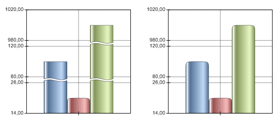

# IChartAxis.UseJointGap

IChartAxis.UseJointGap
-

# IChartAxis.UseJointGap

## Синтаксис

UseJointGap : Boolean;

## Описание

Свойство UseJointGap устанавливает разрывы на столбиках при использовании масштабируемой шкалы по оси (кластеризация, распределение).

## Комментарии

Если значение свойства True, то будут использованы разрывы, при значении False - нет.

Данное свойство доступно только для гистограммы.

## Пример

В рассматриваемом примере предполагается существование объекта Chart типа IChart.

			Sub UseJointGap;

Var

    Chart: IChart;

    AxY: IChartAxis;

Begin

    AxY := Chart.AxisY;

    AxY.AutoScale := ChartAutoScaleMode.Clustering;

    AxY.AutoScaleParameter := 2;

    AxY.UseJointGap := True;

End Sub UseJointGap;

После выполнения примера для диаграммы будут использованы разрывы.

Ниже приведен пример с использованием (слева) и без использования (справа) разрывов.

См. также:

[IChartAxis](IChartAxis.htm)

		Справочная
		 система на версию 10.9
		 от 18/08/2025,
		 © ООО «ФОРСАЙТ»,
