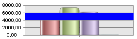

# IChartAxisLevelLine.InterlineColor

IChartAxisLevelLine.InterlineColor
-

# IChartAxisLevelLine.InterlineColor

## Синтаксис

InterlineColor: [IGxColor](ModDrawing.chm::/Interface/IGxColor/IGxColor.htm);

## Описание

Свойство InterlineColor определяет
 цвет заливки области от одной до следующей за ней по значению линии уровней
 диаграммы. Заливка происходит только в случае, если значения свойства
 DrawUnderSeries у обеих линий
 одинаковые. При DrawUnderSeries = NULL
 заливка отсутствует.

## Пример

Для выполнения примера предполагается наличие формы, расположенной на
 ней кнопки с наименованием «Button1»,
 компонентов ChartBox, UiChart и компонента UiErAnalyzer с наименованием
 «UiErAnalyzer1», являющегося источником
 данных.

			Class TESTForm: Form

    Button1: Button;

    UiChart1: UiChart;

    UiErAnalyzer1: UiErAnalyzer;

    ChartBox1: ChartBox;

    Sub Button1OnClick(Sender: Object; Args: IMouseEventArgs);

    Var

        APen: IGxPen;

        col: IGxColor;

    Begin

        ChartBox1.Chart.AxisY.LevelLines.Add(4000, APen);

        ChartBox1.Chart.AxisY.LevelLines.Add(6000, APen);

        ChartBox1.Chart.AxisY.LevelLines.Item(0).InterlineColor := GxColor.FromName("Blue");

    End Sub Button1OnClick;

End Class TESTForm;

После выполнения примера область между двумя соседними уровнями будет
 залита синим цветом:

См. также:

[IChartAxisLevelLine](IChartAxisLevelLine.htm)

		Справочная
		 система на версию 10.9
		 от 18/08/2025,
		 © ООО «ФОРСАЙТ»,
