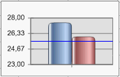

# IChartAxisLevelLine.Pen

IChartAxisLevelLine.Pen
-

# IChartAxisLevelLine.Pen

## Синтаксис

Pen: [IGxPen](ModDrawing.chm::/Interface/IGxPen/IGxPen.htm);

## Описание

Свойство Pen определяет параметры
 начертания линии уровня.

## Пример

Данный модуль подключается к регламентному отчету, на листе которого
 расположена диаграмма. На диаграмме должна присутствовать линия уровня.

	Sub Custom;

	Var

	    Chart: IChart;

	    LevelLine: IChartAxisLevelLine;

	Begin

	    Chart := PrxReport.ActiveReport.ActiveSheet.Table.Objects.Item(0).Extension As IChart;

	    LevelLine := Chart.AxisY.LevelLines.Item(0);

	    LevelLine.Pen := New GxPen.CreateSolid(New GxColor.FromName("Blue"), 1.00);

	    PrxReport.ActiveReport.ActiveSheet.Recalc;

	End Sub Custom;

После выполнения примера первая линия уровня на диаграмме будет изображена
 синим цветом с толщиной в 1 пункт:

См. также:

[IChartAxisLevelLine](IChartAxisLevelLine.htm)

		Справочная
		 система на версию 10.9
		 от 18/08/2025,
		 © ООО «ФОРСАЙТ»,
