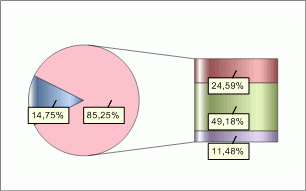

# IChartCircleExInfo.Background

IChartCircleExInfo.Background
-

# IChartCircleExInfo.Background

## Синтаксис

Background: [IChartBackgroundInfo](../IChartBackgroundInfo/IChartBackgroundInfo.htm);

## Описание

Свойство Background определяет
 параметры заливки объединенной группы рядов.

## Пример

Для выполнения примера предполагается наличие листа регламентного отчета
 с расположенной на нем диаграммой.

	Sub UserProc;

	Var

	    C: IChart;

	    CircleEx: IChartCircleExInfo;

	    Color: IGxColor;

	Begin

	    C := (PrxReport.ActiveReport.ActiveSheet.Table.Objects.Item(0).Extension As IChart);

	    C.Type := ChartType.SecondaryBars;

	    CircleEx := C.CircleInfoEx;

	    CircleEx.Background.Color := GxColor.FromName("Pink");

	    PrxReport.ActiveReport.ActiveSheet.Recalc;

	End Sub UserProc;

После выполнения примера цвет заливки объединенной группы рядов будет
 изменен на розовый:

См. также:

[IChartCircleExInfo](IChartCircleExInfo.htm)

		Справочная
		 система на версию 10.9
		 от 18/08/2025,
		 © ООО «ФОРСАЙТ»,
