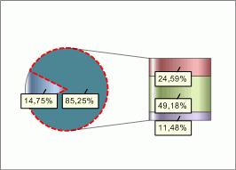

# IChartCircleExInfo.BorderPen

IChartCircleExInfo.BorderPen
-

# IChartCircleExInfo.BorderPen

## Синтаксис

BorderPen: [IGxPen](ModDrawing.chm::/Interface/IGxPen/IGxPen.htm);

## Описание

Свойство BorderPen определяет
 параметры линии границы объединенной группы рядов.

## Пример

Для выполнения примера предполагается наличие листа регламентного отчета
 с расположенной на нем диаграммой.

	Sub UserProc;

	Var

	    C: IChart;

	    CircleEx: IChartCircleExInfo;

	    BPen: IGxPen;

	Begin

	    C := (PrxReport.ActiveReport.ActiveSheet.Table.Objects.Item(0).Extension As IChart);

	    C.Type := ChartType.SecondaryBars;

	    CircleEx := C.CircleInfoEx;

	    BPen := New GxPen.CreateSolid(GxColor.FromName("Red"));

	    BPen.Width := 0.5;

	    BPen.DashStyle := GxDashStyle.Dash;

	    CircleEx.BorderPen := BPen;

	    PrxReport.ActiveReport.ActiveSheet.Recalc;

	End Sub UserProc;

После выполнения примера у объединенной группы рядов появится красная
 пунктирная обводка:

См. также:

[IChartCircleExInfo](IChartCircleExInfo.htm)

		Справочная
		 система на версию 10.9
		 от 18/08/2025,
		 © ООО «ФОРСАЙТ»,
