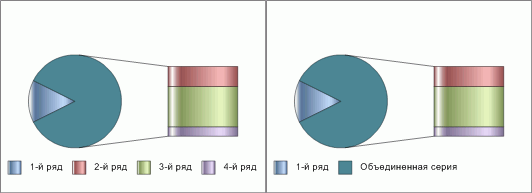

# IChartCircleExInfo.CollapseLegendItems

IChartCircleExInfo.CollapseLegendItems
-

# IChartCircleExInfo.CollapseLegendItems

## Синтаксис

CollapseLegendItems: Boolean;

## Описание

Свойство CollapseLegendItems
 определяет параметры отображения легенды круговой вторичной диаграммы.

## Комментарии

Если значение свойства True,
 то в легенде выводится пиктограмма, имя объединенной группы рядов и всех
 рядов основной диаграммы. False
 - в легенде выводится пиктограммы и имена всех рядов диаграммы. По умолчанию
 свойство принимает значение False.

## Пример

Для выполнения примера предполагается наличие листа регламентного отчета
 с расположенной на нем диаграммой.

	Sub UserProc;

	Var

	    C: IChart;

	    CircleEx: IChartCircleExInfo;

	Begin

	    C := (PrxReport.ActiveReport.ActiveSheet.Table.Objects.Item(0).Extension As IChart);

	    C.Type := ChartType.SecondaryBars;

	    CircleEx := C.CircleInfoEx;

	    C.DisplayLegend := True;

	    CircleEx.CollapseLegendItems := True;

	    PrxReport.ActiveReport.ActiveSheet.Recalc;

	End Sub UserProc;

После выполнения примера будет отображена легенда с пиктограммами, именами
 для объединенной группы рядов и для всех рядов основной диаграммы.

Ниже приведен пример диаграммы и легенды с пиктограммами, именами для
 всех рядов диаграммы (слева) и для объединенной группы рядов и всех рядов
 основной диаграммы (справа):

См. также:

[IChartCircleExInfo](IChartCircleExInfo.htm)

		Справочная
		 система на версию 10.9
		 от 18/08/2025,
		 © ООО «ФОРСАЙТ»,
