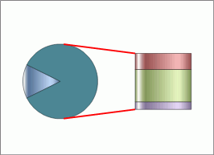

# IChartCircleExInfo.ConnectionLinePen

IChartCircleExInfo.ConnectionLinePen
-

# IChartCircleExInfo.ConnectionLinePen

## Синтаксис

ConnectionLinePen: [IGxPen](ModDrawing.chm::/Interface/IGxPen/IGxPen.htm);

## Описание

Свойство ConnectionLinePen определяет
 параметры соединительной линии между основной и дополнительной диаграммой.

Примечание.
 Для того чтобы не отображать соединительную линию, данному свойству необходимо
 задать значение Null.

## Пример

Для выполнения примера предполагается наличие листа регламентного отчета
 с расположенной на нем диаграммой.

	Sub UserProc;

	Var

	    C: IChart;

	    CircleEx: IChartCircleExInfo;

	    BPen: IGxPen;

	Begin

	    C := (PrxReport.ActiveReport.ActiveSheet.Table.Objects.Item(0).Extension As IChart);

	    C.Type := ChartType.SecondaryBars;

	    CircleEx := C.CircleInfoEx;

	    BPen := New GxPen.CreateSolid(GxColor.FromName("Red"),0.5);

	    CircleEx.ConnectionLinePen := BPen;

	    PrxReport.ActiveReport.ActiveSheet.Recalc;

	End Sub UserProc;

После выполнения примера соединительная линия будет красной:

См. также:

[IChartCircleExInfo](IChartCircleExInfo.htm)

		Справочная
		 система на версию 10.9
		 от 18/08/2025,
		 © ООО «ФОРСАЙТ»,
