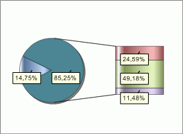

# IChartCircleExInfo.DisplayShadow

IChartCircleExInfo.DisplayShadow
-

# IChartCircleExInfo.DisplayShadow

## Синтаксис

DisplayShadow: Boolean;

## Описание

Свойство DisplayShadow определяет
 признак отображения тени основной диаграммы. Если значение данного свойства
 True, то на диаграмме будет отображена
 тень, при значении False - нет.

## Пример

Для выполнения примера предполагается наличие листа регламентного отчета
 с расположенной на нем диаграммой.

	Sub Userproc;

	Var

	    C: IChart;

	    CircleEx: IChartCircleExInfo;

	Begin

	    C := (PrxReport.ActiveReport.ActiveSheet.Table.Objects.Item(0).Extension As IChart);

	    C.Type := ChartType.SecondaryBars;

	    CircleEx := C.CircleInfoEx;

	    CircleEx.DisplayShadow:=True;

	    PrxReport.ActiveReport.ActiveSheet.Recalc;

	End Sub UserProc;

После выполнения примера будет отображена тень основной диаграммы:

См. также:

[IChartCircleExInfo](IChartCircleExInfo.htm)

		Справочная
		 система на версию 10.9
		 от 18/08/2025,
		 © ООО «ФОРСАЙТ»,
