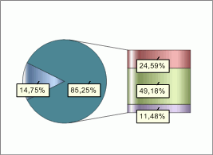

# IChartCircleExInfo.Distance

IChartCircleExInfo.Distance
-

# IChartCircleExInfo.Distance

## Синтаксис

Distance: Double;

## Описание

Свойство Distance определяет
 расстояние между основной и дополнительной диаграммами относительно радиуса
 основной диаграммы. Значение данного параметра должно быть в диапазоне
 [0,0; 2,0].

## Пример

Для выполнения примера предполагается наличие
 листа регламентного отчета с расположенной на нем диаграммой.

	Sub UserProc;

	Var

	    C: IChart;

	    CircleEx: IChartCircleExInfo;

	Begin

	    C := (PrxReport.ActiveReport.ActiveSheet.Table.Objects.Item(0).Extension As IChart);

	    C.Type := ChartType.SecondaryBars;

	    CircleEx := C.CircleInfoEx;

	    CircleEx.Distance:=0.5;

	    PrxReport.ActiveReport.ActiveSheet.Recalc;

	End Sub UserProc;

После выполнения примера расстояние между дополнительной и основной
 диаграммой будет равным половине радиуса основной диаграммы:

См. также:

[IChartCircleExInfo](IChartCircleExInfo.htm)

		Справочная
		 система на версию 10.9
		 от 18/08/2025,
		 © ООО «ФОРСАЙТ»,
