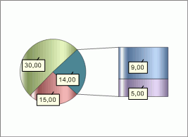

# IChartCircleExInfo.GroupingRule

IChartCircleExInfo.GroupingRule
-

# IChartCircleExInfo.GroupingRule

## Синтаксис

GroupingRule: [ChartSerieGroupRule](../../Enums/ChartSerieGroupRule.htm);

## Описание

Свойство GroupingRule определяет
 порядок группировки рядов для вторичной диаграммы. Значение по умолчанию
 [ChartSerieGroupRule.Position](../../Enums/ChartSerieGroupRule.htm).

Примечание.
 Данное свойство используется совместно со свойством [IChartCircleExInfo.GroupingValue](IChartCircleExInfo.GroupingValue.htm)
 или [IChartCircleExInfo.CustomSerieGroup](IChartCircleExInfo.CustomSerieGroup.htm).

## Пример

Для выполнения примера предполагается наличие листа регламентного отчета
 с расположенной на нем диаграммой.

	Sub UserProc;

	Var

	    C: IChart;

	    CircleEx: IChartCircleExInfo;

	Begin

	    C := (PrxReport.ActiveReport.ActiveSheet.Table.Objects.Item(0).Extension As IChart);

	    C.Type := ChartType.SecondaryBars;

	    CircleEx := C.CircleInfoEx;

	    CircleEx.GroupingValue := 12;

	    CircleEx.GroupingRule := ChartSerieGroupRule.Value;

	    PrxReport.ActiveReport.ActiveSheet.Recalc;

	End Sub UserProc;

После выполнения примера для вторичной диаграммы будут сгруппированы
 ряды со значением ряда меньше «12»:

См. также:

[IChartCircleExInfo](IChartCircleExInfo.htm)

		Справочная
		 система на версию 10.9
		 от 18/08/2025,
		 © ООО «ФОРСАЙТ»,
