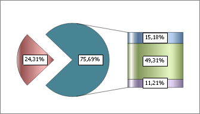

# IChartCircleExInfo.PieDistanceCoef

IChartCircleExInfo.PieDistanceCoef
-

# IChartCircleExInfo.PieDistanceCoef

## Синтаксис

PieDistanceCoef: Double;

## Описание

Свойство PieDistanceCoef определяет
 расстояние от центра основной диаграммы до дольки объединенной группы
 рядов.

## Комментарии

Расстояние измеряется в доле от радиуса круговой диаграммы. Значение
 данного параметра должно быть в диапазоне [0.0; 1.0].

## Пример

Для выполнения примера предполагается наличие листа регламентного отчета
 с расположенной на нем диаграммой.

	Sub UserProc;

	Var

	    C: IChart;

	    CircleEx: IChartCircleExInfo;

	Begin

	    C := (PrxReport.ActiveReport.ActiveSheet.Table.Objects.Item(0).Extension As IChart);

	    C.Type := ChartType.SecondaryBars;

	    CircleEx := C.CircleInfoEx;

	    CircleEx.PieDistanceCoef := 0.5;

	    PrxReport.ActiveReport.ActiveSheet.Recalc;

	End Sub UserProc;

После выполнения примера расстояние от центра основной диаграммы до
 дольки объединенной группы рядов будет равным половине радиуса основной
 диаграммы:

См. также:

[IChartCircleExInfo](IChartCircleExInfo.htm)

		Справочная
		 система на версию 10.9
		 от 18/08/2025,
		 © ООО «ФОРСАЙТ»,
