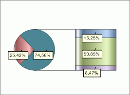

# IChartCircleExInfo.SecondaryRadius

IChartCircleExInfo.SecondaryRadius
-

# IChartCircleExInfo.SecondaryRadius

## Синтаксис

SecondaryRadius: Double;

## Описание

Свойство SecondaryRadius определяет
 размер вторичной диаграммы. Значение данного свойства должно быть в диапазоне
 [0,05; 2.0].

## Комментарии

Если вторичная диаграмма круговая, то свойство SecondaryRadius
 определяет радиус вторичной диаграммы относительно радиуса основной.

Если вторичная диаграмма является гистограммой, то свойство SecondaryRadius
 определяет высоту вторичной диаграммы относительно диаметра основной.

## Пример

Для выполнения примера предполагается наличие листа регламентного отчета
 с расположенной на нем диаграммой.

	Sub UserProc;

	Var

	    C: IChart;

	    CircleEx: IChartCircleExInfo;

	Begin

	    C := (PrxReport.ActiveReport.ActiveSheet.Table.Objects.Item(0).Extension As IChart);

	    C.Type := ChartType.SecondaryBars;

	    CircleEx := C.CircleInfoEx;

	    CircleEx.SecondaryRadius := 1;

	    PrxReport.ActiveReport.ActiveSheet.Recalc;

	End Sub UserProc;

После выполнения примера высота вторичной диаграммы будет равна диаметру
 основной диаграммы:

См. также:

[IChartCircleExInfo](IChartCircleExInfo.htm)

		Справочная
		 система на версию 10.9
		 от 18/08/2025,
		 © ООО «ФОРСАЙТ»,
