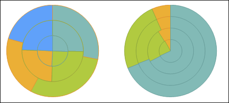

# IChartCircleInfo.SeriesAsRings

IChartCircleInfo.SeriesAsRings
-

# IChartCircleInfo.SeriesAsRings

## Синтаксис

SeriesAsRings: Boolean;

## Описание

Свойство SeriesAsRings определяет
 признак отображения рядов в кольцах диаграммы.

## Комментарии

Допустимые значения:

	- True. Ряды диаграммы
	 отображаются в кольцах;

	- False. Ряды диаграммы
	 отображаются по секторам.

Свойство не актуально для кольцевой диаграммы ([IChart.Type](../IChart/IChart.Type.htm) = ChartType.HoleSize).

Пример отображения круговой диаграммы с рядами в кольцах (слева) и секторно
 (справа):

## Пример

Для выполнения примера разместите на форме кнопку, компоненты ChartBox
 и UiChart. Добавьте обработчики событий, которые используются в примере.

Добавьте ссылки на системные сборки «Chart», «MathFin».

			Sub UiChart1OnGetDataValue(Sender: Object; Args: IUiChartGetDataValueEventArgs);

Begin

    Args.Result := True;

    Args.Value := Math.Rand;

    ChartBox1.Source := UiChart1 As IChartSource;

    UiChart1.Type := ChartType.Circles;

End Sub UiChart1OnGetDataValue;

…

Sub Button1OnClick(Sender: Object; Args: IMouseEventArgs);

Begin

    UiChart1.Chart.CircleInfo.SeriesAsRings := True;

End Sub Button1OnClick;

При выполнении примера будет отображена круговая диаграмма с рядами
 в секторах. После нажатия кнопки ряды будут отображаться в кольцах.

См. также:

[IChartCircleInfo](IChartCircleInfo.htm)

		Справочная
		 система на версию 10.9
		 от 18/08/2025,
		 © ООО «ФОРСАЙТ»,
