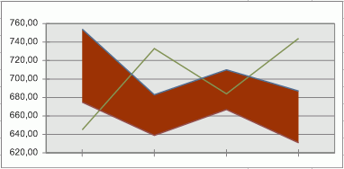

# IChartCorridor.Color

IChartCorridor.Color
-

# IChartCorridor.Color

## Синтаксис

Color: [IGxColor](ModDrawing.chm::/Interface/IGxColor/IGxColor.htm);

## Описание

Свойство Color определяет
 цвет монотонной заливки коридора диаграммы.

## Пример

В рассматриваемом примере предполагается, что существует объект Corridor типа IChartCorridor.

	Sub CoridorColor;

	Var

	    Corridor: IChartCorridor;

	Begin

	    Corridor.GradientFill := False;

	    Corridor.Color := GxColor.FromName("Brown");

	End Sub CoridorColor;

После выполнения примера цвет заливки коридора станет коричневым:

См. также:

[IChartCorridor](IChartCorridor.htm)

		Справочная
		 система на версию 10.9
		 от 18/08/2025,
		 © ООО «ФОРСАЙТ»,
