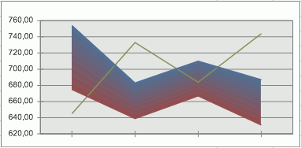

# IChartCorridors.Item

IChartCorridors.Item
-

# IChartCorridors.Item

## Синтаксис

Item(Index: Integer): [IChartCorridor](../IChartCorridor/IChartCorridor.htm);

## Параметры

Index - индекс коридора в коллекции.
 Нумерация начинается с нуля.

## Описание

Свойство Item позволяет определить
 параметры конкретного коридора диаграммы.

## Пример

Для выполнения примера предполагается наличие листа регламентного отчета,
 с расположенной на нем линейной диаграммой. На диаграмме должны быть заданы
 коридоры.

	Sub Cor;

	Var

	    ActiveReport: IPrxReport;

	    Sheet: IPrxSheet;

	    PrxTable: IPrxTable;

	    TabSheet: ITabSheet;

	    C: IChart;

	    Corridor: IChartCorridors;

	    Co: IChartCorridor;

	Begin

	    ActiveReport := PrxReport.ActiveReport;

	    Sheet := ActiveReport.Sheets.Item(0);

	    PrxTable := Sheet As IPrxTable;

	    TabSheet := PrxTable.TabSheet;

	    C := TabSheet.Objects.Item(0).Extension As IChart;

	    Corridor := C.Corridors;

	    Co := Corridor.Item(0);

	    Co.GradientFill := True;

	End Sub Cor;

После выполнения примера тип заливки коридора диаграммы будет изменен
 на градиентный, например:

См. также:

[IChartCorridors](IChartCorridors.htm)

		Справочная
		 система на версию 10.9
		 от 18/08/2025,
		 © ООО «ФОРСАЙТ»,
