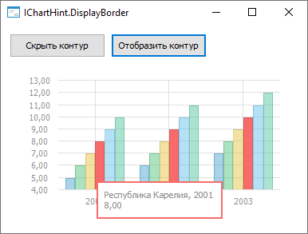
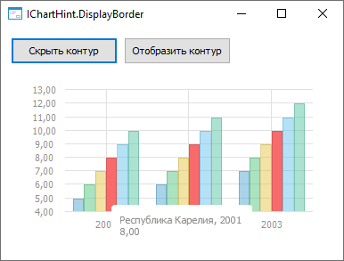

# IChartHint.DisplayBorder

IChartHint.DisplayBorder
-

# IChartHint.DisplayBorder

## Синтаксис

DisplayBorder: Boolean;

## Описание

Свойство DisplayBorder определяет,
 отображается ли контур всплывающих подсказок на диаграмме.

## Комментарии

Допустимые значения:

	- True. По умолчанию.
	 Контур всплывающих подсказок отображается на диаграмме;

	- False. Контур всплывающих
	 подсказок не отображаются на диаграмме.

## Пример

Для выполнения примера разместите на форме два компонента Button,
 ChartBox и UiErAnalyzer
 с наименованиями BUTTON1, BUTTON2, CHARTBOX1 и UIERANALYZER1 соответственно.
 Для компонента ChartBox установите
 свойству Source значение UiErAnalyzer1.
 Для компонента Button1 установите
 свойству Text значение «Скрыть
 контур», для компонента Button2
 - «Отобразить контур». Для компонента UiErAnalyzer
 установите свойству Active значение
 True. Предполагается наличие экспресс-отчета,
 который указан в качестве свойства Object
 для компонента UiErAnalyzer.

Добавьте ссылки на системные сборки: Chart, Drawing, Express, Forms.

	Sub Button1OnClick(Sender: Object; Args: IMouseEventArgs);

	Var

	    Chart: IChart;

	    Hint: IChartHint;

	Begin

	    Chart := ChartBox1.Chart;

	    Hint := Chart.HintFormat;

	    Hint.DisplayBorder:= False;

	End Sub Button1OnClick;

	Sub Button2OnClick(Sender: Object; Args: IMouseEventArgs);

	Var

	    Chart: IChart;

	    Hint: IChartHint;

	Begin

	    Chart := ChartBox1.Chart;

	    Hint := Chart.HintFormat;

	    Hint.DisplayBorder:= True;

	End Sub Button2OnClick;

После нажатия на кнопку «Отобразить контур» и наведения на ряд диаграммы контур всплывающих подсказок
 будет отображен:

После нажатия на кнопку «Скрыть контур» и наведения на ряд диаграммы контур всплывающих подсказок
 будет скрыт:

См. также:

[IChartHint](IChartHint.htm)

		Справочная
		 система на версию 10.9
		 от 18/08/2025,
		 © ООО «ФОРСАЙТ»,
