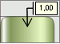

# IChartLabel.Cap

IChartLabel.Cap
-

# IChartLabel.Cap

## Синтаксис

Cap: [ChartLineCapType](../../Enums/ChartLineCapType.htm);

## Описание

Свойство Cap определяет тип
 окончания линии подписи данных.

## Пример

В рассматриваемом примере предполагается, что существует объект Label типа IChartLabel.

	Sub Custom;

	Var

	    Label : IChartLabel;

	Begin

	    Label.Type := 1 As ChartLabelType;

	    Label.Cap := 1 As ChartLineCapType;

	End Sub Custom;

После выполнения примера линия подписи данных будет оканчиваться на
 стрелку c углом наклона 30 градусов:

См. также:

[IChartLabel](IChartLabel.htm)

		Справочная
		 система на версию 10.9
		 от 18/08/2025,
		 © ООО «ФОРСАЙТ»,
