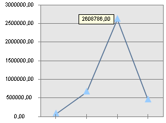

# IChartLabel.HorizontalHotspotAlignment

IChartLabel.HorizontalHotspotAlignment
-

# IChartLabel.HorizontalHotspotAlignment

## Синтаксис

HorizontalHotspotAlignment: [ChartHorizontalAlignment](../../Enums/ChartHorizontalAlignment.htm);

## Описание

Свойство HorizontalHotspotAlignment
 определяет положение подписи данных по горизонтали.

## Комментарии

Положение подписи данных задается относительно маркера. По умолчанию
 по горизонтали подпись данных выравнивается по центру.

Примечание.
 При выборе варианта Right/Left подпись данных будет расположена слева/справа.
 Это вызвано тем, что точка отсчета положения подписи данных берется наоборот
 относительно маркера.

## Пример

Для выполнения примера предполагается наличие регламентного отчета,
 на листе которого расположена диаграмма. К отчету добавлен модуль, из
 которого с помощью гиперссылки вызывается процедура UserProc. В инспекторе
 сборок модуля должны быть указаны ссылки на системные сборки Chart, Report,
 Tab.

			Sub UserProc;

Var

    Chart : IChart;

    Serie : IChartSerie;

Begin

    Chart := (PrxReport.ActiveReport.ActiveSheet As IPrxTable).TabSheet.Objects.Item(0).Extension As IChart;

    Serie := Chart.Series.Item(0);

    Serie.Label(2).Visible := True;

    Serie.Label(2).HorizontalHotspotAlignment := ChartHorizontalAlignment.Right;

End Sub UserProc;

После выполнения примера 3 подпись данных (нумерация подписей данных
 начинается с нуля) будет выравнена слева от ряда.

См. также:

[IChartLabel](IChartLabel.htm)

		Справочная
		 система на версию 10.9
		 от 18/08/2025,
		 © ООО «ФОРСАЙТ»,
