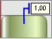

# IChartLabel.Pen

IChartLabel.Pen
-

# IChartLabel.Pen

## Синтаксис

Pen: [IGxPen](ModDrawing.chm::/Interface/IGxPen/IGxPen.htm);

## Описание

Свойство Pen определяет параметры
 линии для подписи данных типа указатель или выноска.

## Пример

В рассматриваемом примере предполагается, что существует объект Label типа IChartLabel.

	Sub Custom;

	Var

	    Label : IChartLabel;

	Begin

	    Label.Type := 1 As ChartLabelType;

	    Label.Pen := New GxPen.CreateSolid(GxColor.FromName("Blue"), 0.5);

	End Sub Custom;

После выполнения примера линия подписи данных будет синего цвета и толщиной
 0,5 мм.

См. также:

[IChartLabel](IChartLabel.htm)

		Справочная
		 система на версию 10.9
		 от 18/08/2025,
		 © ООО «ФОРСАЙТ»,
