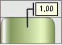

# IChartLabel.Type

IChartLabel.Type
-

# IChartLabel.Type

## Синтаксис

Type: [ChartLabelType](../../Enums/ChartLabelType.htm);

## Описание

Свойство Type определяет тип
 подписи данных: простая, выноска или указатель.

## Пример

В рассматриваемом примере предполагается, что существует объект Label типа IChartLabel.

	Sub Custom;

	Var

	    Label : IChartLabel;

	Begin

	    Label.Type := 1 As ChartLabelType;

	End Sub Custom;

После выполнения примера тип подписи данных изменится на выноску:

См. также:

[IChartLabel](IChartLabel.htm)

		Справочная
		 система на версию 10.9
		 от 18/08/2025,
		 © ООО «ФОРСАЙТ»,
