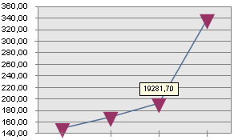

# IChartLabel.VerticalHotspotAlignment

IChartLabel.VerticalHotspotAlignment
-

# IChartLabel.VerticalHotspotAlignment

## Синтаксис

VerticalHotspotAlignment: [ChartVerticalAlignment](../../Enums/ChartVerticalAlignment.htm);

## Описание

Свойство VerticalHotspotAlignment
 определяет положение подписи по вертикали.

## Комментарии

Положение подписи задается относительно [маркера](../IChartMarker/IChartMarker.htm).
 То есть, данное положение подписи целесообразно задавать только для линейного
 типа ряда. По умолчанию по вертикали подпись выравнивается по середине.

Примечание.
 При выборе варианта Top/Bottom подпись будет расположена снизу/сверху.
 Это вызвано с тем, что точка отсчета положения подписи данных берется
 наоборот относительно маркера.

## Пример

В рассматриваемом примере предполагается, что существует объект Serie типа IChartSerie
 с 4-мя точками на графике.

	Sub Vertical;

	Var

	    Serie : IChartSerie;

	Begin

	    Serie.Label(3).Visible := True;

	    Serie.Label(3).VerticalHotspotAlignment := ChartVerticalAlignment.Bottom;

	End Sub Vertical;

После выполнения примера 4 подпись данных (нумерация подписей данных
 начинается с нуля) будет выравнена сверху от ряда.

См. также:

[IChartLabel](IChartLabel.htm)

		Справочная
		 система на версию 10.9
		 от 18/08/2025,
		 © ООО «ФОРСАЙТ»,
