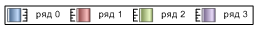

# IChartLegend.AxisIcon

IChartLegend.AxisIcon
-

# IChartLegend.AxisIcon

## Синтаксис

AxisIcon: [ChartLegendAxisIcon](../../Enums/ChartLegendAxisIcon.htm);

## Описание

Свойство AxisIcon определяет признак отображения в легенде значка, который указывает по какой оси расположен ряд (основной или дополнительной). Флаг применяется только при использовании в диаграмме дополнительной оси.

## Комментарии

По умолчанию свойство имеет значение None.

## Пример

Для выполнения примера понадобится форма с размещёнными на ней компонентами Button, ChartBox и UiChart с идентификаторами «Button1», «ChartBox1» и «UiChart1» соответственно.

			Sub Button1OnClick(Sender: Object; Args: IMouseEventArgs);

Var

    Chart: IChart;

    ChartLegend: IChartLegend;

    Serie: IChartSerie;

Begin

    Chart := ChartBox1.Chart;

    ChartLegend := Chart.Legend;

    Serie := Chart.Series.Item(0);

    Serie.AtSecondaryAxis := True;

    ChartLegend.AxisIcon := ChartLegendAxisIcon.Axis;

    ChartLegend.Alignment := ChartLegendAlignment.Right;

End Sub Button1OnClick;

После выполнения примера при нажатии на компонент «Button1» у диаграммы появится дополнительная ось, а у элементов легенды будут отображаться дополнительные значки, указывающие на принадлежность ряда к основной или дополнительной оси. Также легенда будет располагаться справа от диаграммы.

Например:

В рассматриваемом примере «Ряд 0» относится к дополнительной оси.

См. также:

[IChartLegend](IChartLegend.htm)

		Справочная
		 система на версию 10.9
		 от 18/08/2025,
		 © ООО «ФОРСАЙТ»,
