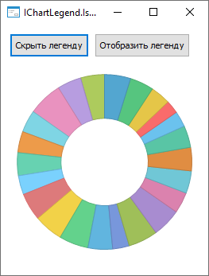
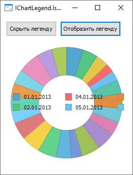

# IChartLegend.IsOverlapped

IChartLegend.IsOverlapped
-

# IChartLegend.IsOverlapped

## Синтаксис

IsOverlapped: Boolean;

## Описание

Свойство IsOverlapped определяет,
 будет ли скрыта легенда при недостатке места на диаграмме.

## Комментарии

Допустимые значения:

	- True. Легенда скрывается
	 при недостатке места в области диаграммы;

	- False. Легенда не скрывается
	 при недостатке места в области диаграммы.

## Пример

Для выполнения примера разместите на форме два компонента Button,
 ChartBox и UiErAnalyzer
 с наименованиями BUTTON1 и BUTTON2, CHARTBOX1 И UIERANALYZER1 соответственно.
 Для компонента ChartBox установите
 свойству Source значение UiErAnalyzer1.
 Для компонента Button1 установите
 свойству Text значение «Скрыть легенду», для компонента Button2
 - «Отобразить легенду».
 Предполагается наличие экспресс-отчета, который указан в качестве свойства
 Object для компонента UiErAnalyzer.

Добавьте ссылки на системные сборки: Chart, Express, Forms.

	Sub Button1OnClick(Sender: Object; Args: IMouseEventArgs);

	Var

	    Chart: IChart;

	    ChartLegend: IChartLegend;

	Begin

	    Chart := ChartBox1.Chart;

	    ChartLegend := Chart.Legend;

	    ChartLegend.IsOverlapped := True;

	    ChartBox1.Chart.Refresh;

	End Sub Button1OnClick;

	Sub Button2OnClick(Sender: Object; Args: IMouseEventArgs);

	Var

	    Chart: IChart;

	    ChartLegend: IChartLegend;

	Begin

	    Chart := ChartBox1.Chart;

	    ChartLegend := Chart.Legend;

	    ChartLegend.IsOverlapped := False;

	    ChartBox1.Chart.Refresh;

	End Sub Button2OnClick;

При нажатии на кнопку «Скрыть легенду» легенда будет скрыта, так как для нее недостаточно
 места на диаграмме, например:

При нажатии на кнопку «Отобразить легенду» легенда не будет скрыта, даже если для нее недостаточно
 места на диаграмме, например:

См. также:

[IChartLegend](IChartLegend.htm)

		Справочная
		 система на версию 10.9
		 от 18/08/2025,
		 © ООО «ФОРСАЙТ»,
