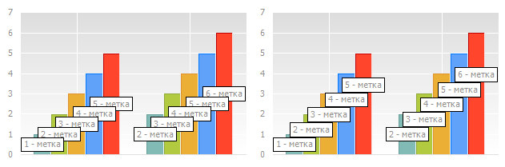

# IChartSeries.AutoplaceLabels

IChartSeries.AutoplaceLabels
-

# IChartSeries.AutoplaceLabels

## Синтаксис

AutoplaceLabels;

## Описание

Метод AutoplaceLabels осуществляет
 размещение подписей данных таким образом, чтобы избежать наложения друг
 на друга.

## Комментарии

Для корректного выполнения метода необходимо, чтобы подписи данных диаграммы
 были отрисованы. При отрисовке рассчитываются размеры подписей данных,
 которые необходимы для их правильного расположения. Если осуществляется
 динамическое создание диаграммы с подписями данных выполните предварительную
 отрисовку подходящим способом, в зависимости от того, где размещена диаграмма:

	- Диаграмма динамически размещена на форме из кода на Fore. Используйте
	 методы [IFormControl.BeginUpdate](ModForms.chm::/Interface/IFormControl/IFormControl.BeginUpdate.htm)/[IFormControl.EndUpdate](ModForms.chm::/Interface/IFormControl/IFormControl.EndUpdate.htm)
	 или [ITabSheet.BeginUpdate](TabSheet.chm::/Interface/ITabSheet/ITabSheet.BeginUpdate.htm)/[ITabSheet.EndUpdate](TabSheet.chm::/Interface/ITabSheet/ITabSheet.EndUpdate.htm),
	 это вызовет отрисовку подписи данных с подобранным расположением.

	- Диаграмма динамически размещена на листе регламентного отчета.
	 Используйте [IChartExporter.GetBitmap](../IChartExporter/IChartExporter.GetBitmap.htm),
	 предварительно передав точные размеры диаграммы ([IChartExporter.PixelHeight](../IChartExporter/IChartExporter.PixelHeight.htm)
	 и [IChartExporter.PixelWidth](../IChartExporter/IChartExporter.PixelWidth.htm)).

Ниже приведен пример расположения подписей данных без авторазмещения
 (слева) и с авторазмещением (справа):

См. также:

[IChartSeries](IChartSeries.htm)

		Справочная
		 система на версию 10.9
		 от 18/08/2025,
		 © ООО «ФОРСАЙТ»,
