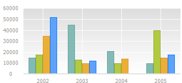

# IChartStyleAbsoluteGroup.MakeAbsolute

IChartStyleAbsoluteGroup.MakeAbsolute
-

# IChartStyleAbsoluteGroup.MakeAbsolute

## Синтаксис

MakeAbsolute;

## Описание

Метод MakeAbsolute позволяет расположить каждый ряд в отдельную группу.

## Комментарии

Необходимо помнить, что метод работает, только если для диаграммы установлен тип шкалы «Смешанный».

В случае необходимости, можно задать данный тип шкалы посредством выполнения команды:

«[Chart.Style](../IChart/IChart.Style.htm) := [ChartStyle.Mixed](../../Enums/ChartStyle.htm)»

## Пример

Для выполнения примера понадобится форма с расположенными на ней компонентами UiChart, ChartBox и Button с идентификаторами «UiChart1», «ChartBox1» и «Button1» соответственно. Компонент «UiChart1» должен являться источником данных для компонента «ChartBox1» и в нём для диаграммы должен быть установлен тип шкалы «Смешанный».

			Sub Button1OnClick(Sender: Object; Args: IMouseEventArgs);

Var

    Chart: IChart;

Begin

    Chart := ChartBox1.Chart;

    Chart.StyleGroup.MakeAbsolute;

End Sub Button1OnClick;

После выполнения примера при нажатии на компонент «Button1» на диаграмме все ряды будут расположены в отдельных группах, например:

См. также:

[IChartStyleAbsoluteGroup](IChartStyleAbsoluteGroup.htm)

		Справочная
		 система на версию 10.9
		 от 18/08/2025,
		 © ООО «ФОРСАЙТ»,
