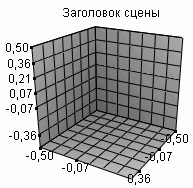

# IScene3DCaption.Style

IScene3DCaption.Style
-

# IScene3DCaption.Style

## Синтаксис

Style: [IScene3DTextStyle](../IScene3DTextStyle/IScene3DTextStyle.htm);

## Описание

Свойство доступно только для чтения.

Свойство Style возвращает параметры
 стиля заголовка.

## Пример

Для выполнения примера предполагается наличие формы, расположенной на
 ней кнопки с наименованием «Button1» и компонента [Chart3DBox](UiDevEnv.chm::/02_Components_constructor_forms/02_Additional_components/Chart3DBox.htm)
 с идентификатором «Chart3DBox1».

	Sub Button1OnClick(Sender: Object; Args: IMouseEventArgs);

	Var

	    Scene3D: IScene3D;

	    Caption: IScene3DCaption;

	    CaptionStyle: IScene3DTextStyle;

	Begin

	    Scene3D := Chart3DBox1.Scene;

	    Caption := Scene3D.Caption;

	    Caption.Text := "Заголовок сцены";

	    CaptionStyle := Caption.Style;

	    CaptionStyle.Visible := True;

	End Sub Button1OnClick;

После выполнения примера для трехмерной сцены будет создан заголовок:

См. также:

[IScene3DCaption](IScene3DCaption.htm)

		Справочная
		 система на версию 10.9
		 от 18/08/2025,
		 © ООО «ФОРСАЙТ»,
