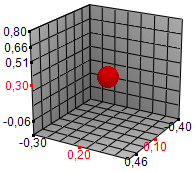

# IScene3DPrimitive.Selected

IScene3DPrimitive.Selected
-

# IScene3DPrimitive.Selected

## Синтаксис

Selected: Boolean;

## Описание

Свойство Selected определяет
 признак выделения объекта. Если значение свойства True,
 то объект выделен, при значении False
 - нет.

По умолчанию свойство имеет значение False.

При выделении объекта «точка» (сфера) ее координаты по осям сцены будут
 отображены красным цветом.

См. также:

[IScene3DPrimitive](IScene3DPrimitive.htm)

		Справочная
		 система на версию 10.9
		 от 18/08/2025,
		 © ООО «ФОРСАЙТ»,
