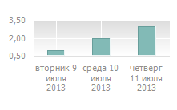

# IUiChartCategoryNameEventArgs.PointIndex

IUiChartCategoryNameEventArgs.PointIndex
-

# IUiChartCategoryNameEventArgs.PointIndex

## Синтаксис

PointIndex: Integer;

## Описание

Свойство доступно только для чтения.

Свойство PointIndex возвращает
 индекс точки.

## Пример

В рассматриваемом примере предполагается существование объекта UiChart1 типа UiChart.

	Sub UiChart1OnGetCategoryName(Sender: Object; Args: IUiChartCategoryNameEventArgs);

	Begin

	    Args.Result := DateTime.AddDays(CurDay, Args.PointIndex);

	End Sub UiChart1OnGetCategoryName;

	Sub UiChart1OnGetCategoryFormat(Sender: Object; Args: IUiChartCategoryFormatEventArgs);

	Begin

	    Args.Result := "dddd dd MMMM yyyy";

	End Sub UiChart1OnGetCategoryFormat;

После выполнения наименования точек для оси категорий будут формироваться
 из наименования дня недели и даты:

См. также:

[IUiChartCategoryNameEventArgs](IUiChartCategoryNameEventArgs.htm)

		Справочная
		 система на версию 10.9
		 от 18/08/2025,
		 © ООО «ФОРСАЙТ»,
