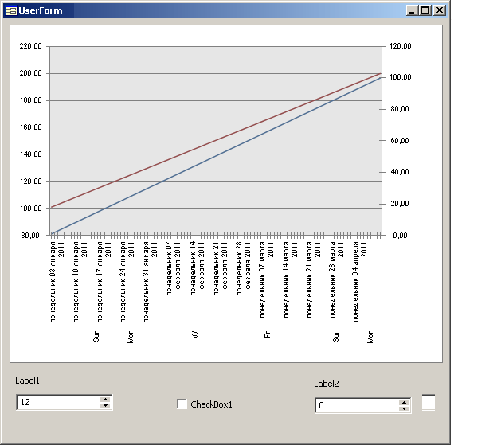

# Вывод подписей шкалы по категориям

Вывод подписей шкалы по категориям
-

# Вывод подписей шкалы по категориям

Ниже представлен пример вывода подписей шкалы по категориям. Для выполнения
 примера создадим сборку с формой UserForm и модулем с кодом пользовательского
 класса CChartPointNameNode. Класс CChartPointNameNode
 описан на странице «[Описание
 пользовательского класса CChartPointNameNode](../Interface/IChartPointNameNode/CChartPointNameNode.htm)». Подключим ссылки на
 системные сборки Chart, Collections, Forms, ExtCtrls. Расположим на форме
 следующие компоненты: Label1, Label2, CheckBox1, ChartBox1, IntegerEdit1,
 IntegerEdit2, UiChart1. Компонент UiChart1 является источником данных
 для компонента ChartBox1.

	Class UserForm: Form

	    Label1: Label;

	    Label2: Label;

	    CheckBox1: CheckBox;

	    ChartBox1: ChartBox;

	    UiChart1: UiChart;

	    IntegerEdit1: IntegerEdit;

	    IntegerEdit2: IntegerEdit;

	    Root, MonthLevel, DayLevel: CChartPointNameNode;

	    m_RootPointsCount: Integer = 0;

	    MaxPointCount: Integer = 3000;

	    CurDay: DateTime;

	//Добавим
	 процедуру, с помощью которой каждому уровню иерархии присваивается
	 значение:

	Sub SetRootPointsCount(Value: Integer);

	    Var

	        d: DateTime;

	        i: Integer;

	    Begin

	        Root.Clear;

	        MonthLevel.Clear;

	        DayLevel.Clear;

	        For i:=0 To Value-1 Do

	            d := DateTime.AddDays(CurDay, i);

	            DayLevel.AddValue(i, "Day Day Day Day " + d.ToString);

	            If d.Day = 1 Then

	                MonthLevel.AddValue(i,d);

	                If d.Month = 1 Then

	                    Root.AddValue(i,d);

	                End If;

	            End If;

	        End For;

	    End Sub SetRootPointsCount;

	//Построение графика:

	    Sub UiChart1OnGetDataValue(Sender: Object; Args: IUiChartGetDataValueEventArgs);

	    Begin

	        Args.Value := Args.PointIndex + Args.SerieIndex * UiChart1.PointCount + 1;

	        Args.Result := True;

	    End Sub UiChart1OnGetDataValue;

	//Создание
	 формы:

	    Sub OBJ773FormOnCreate(Sender: Object; Args: IEventArgs);

	    Begin

	        CurDay := DateTime.ComposeDay(DateTime.Now.Date.Year, 1, 1);

	        Root := New CChartPointNameNode.Create(Null); // YearLevel

	        Root.Format := "dd MMMM yyyy";

	        Root.Name := "Years";

	        MonthLevel := New CChartPointNameNode.Create(Root);

	        MonthLevel.Format := Root.Format;

	        MonthLevel.Name := "Months";

	        DayLevel := New CChartPointNameNode.Create(MonthLevel);

	        DayLevel.Format := Root.Format;

	        DayLevel.Name := "Days";

	        SetRootPointsCount(MaxPointCount);

	        IntegerEdit1.MaxValue := UiChart1.PointCount * UiChart1.SerieCount;

	        IntegerEdit2.MaxValue := MaxPointCount;

	        IntegerEdit2.Value := UiChart1.PointCount;

	        UiChart1.Chart.Series.Item(0).AtSecondaryAxis := True;

	        UiChart1.Chart.AxisX.TextAngle := 90;

	    End Sub OBJ773FormOnCreate;

	//Добавляем
	 событие, которое позволяет редактору целочисленных значений отображать
	 количество точек //графика:

	    Sub IntegerEdit1OnChange(Sender: Object; Args: IEventArgs);

	    Begin

	        UiChart1.PointCount := IntegerEdit1.Value;

	    End Sub IntegerEdit1OnChange;

	//Добавляем событие, которое позволяет
	 редактору целочисленных значений отображать количество //категорий
	 между подписями делений:

	    Sub IntegerEdit2OnChange(Sender: Object; Args: IEventArgs);

	    Begin

	        UiChart1.Chart.TickLabelSpacing := IntegerEdit2.Value;

	    End Sub IntegerEdit2OnChange;

	//Добавляем событие, позволяющее определить
	 наименования точек на графике:

	    Sub UiChart1OnGetPointName(Sender: Object; Args: IUiChartPointNameEventArgs);

	    Begin

	        Args.Result := "Point Point Point Point Point Point Point N " + Args.PointIndex.ToString;

	    End Sub UiChart1OnGetPointName;

	//Добавляем
	 событие, позволяющее определить формат наименования точек для оси
	 категорий:

	    Sub UiChart1OnGetCategoryFormat(Sender: Object; Args: IUiChartCategoryFormatEventArgs);

	    Begin

	        Args.Result := "dddd dd MMMM yyyy";

	    End Sub UiChart1OnGetCategoryFormat;

	//Добавляем событие, позволяющее определить
	 корневой элемент для иерархии

	//оси
	 категорий. В обработчике указываем, что если будет установлен флаг,
	 то корневым элементом иерархии будет значение года:

	    Sub UiChart1OnGetPointNameRoot(Sender: Object; Args: IUiChartPointNameRootEventArgs);

	    Begin

	        If CheckBox1.Checked Then

	            Args.Result := Root As IChartPointNameNode;

	        End If;

	        If Not CheckBox1.Checked Then

	            Args.Result := NULL;

	        End If;

	    End Sub UiChart1OnGetPointNameRoot;

	//Добавляем
	 событие, позволяющее определить наименование точек для оси категорий:

	    Sub UiChart1OnGetCategoryName(Sender: Object; Args: IUiChartCategoryNameEventArgs);

	    Begin

	        Args.Result := DateTime.AddDays(CurDay, Args.PointIndex);

	    End Sub UiChart1OnGetCategoryName;

	End Class OBJ773Form;

После выполнения примера будет создана форма, на которой расположен
 график, редакторы целочисленных значений «PointCounts», определяющий количество
 точек на оси категорий, и «TickLableSpacing», определяющий количество
 категорий между подписями делений, а также флаг определения корневого
 элемента иерархии. Подписи на шкале категорий отображаются согласно заданному
 формату отображения уровней иерархии:

См. также:

[IChartPointNameNode](../Interface/IChartPointNameNode/IChartPointNameNode.htm)|[Примеры](Chart_Example.htm)

		Справочная
		 система на версию 10.9
		 от 18/08/2025,
		 © ООО «ФОРСАЙТ»,
