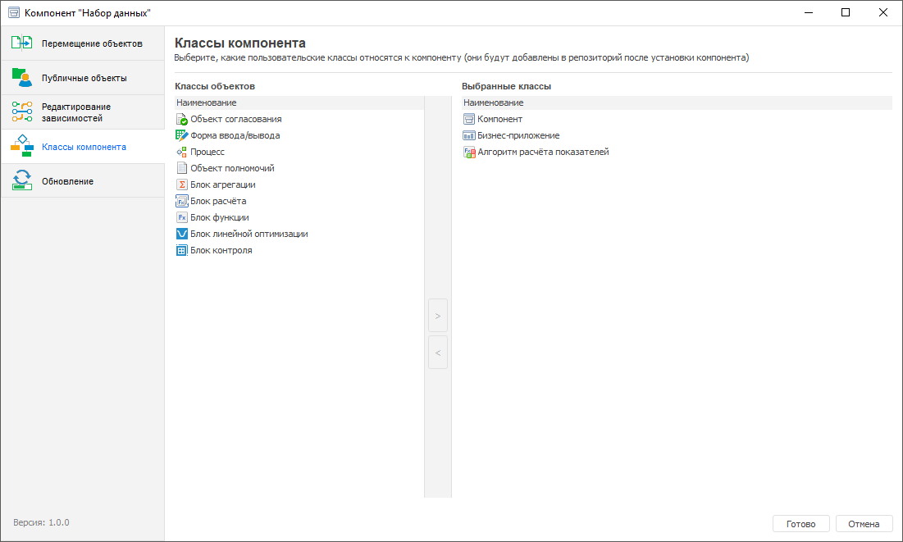

# Выбор используемых классов объектов: Компонент, настольное приложение

Выбор используемых классов объектов: Компонент, настольное приложение
-

# Выбор используемых классов объектов

Для выбора используемых [классов
 объектов](UiDevEnv.chm::/04_NavigatorSetting/Classes_Object/ObjectsClasses.htm), которые относятся к данному компоненту и
 будут добавлены в репозиторий после установки компонента, выполните шаги:

	- Откройте компонент на редактирование в навигаторе объектов:

		- нажмите кнопку  «Редактировать»
		 в группе «Открыть» на
		 вкладке «Главная» ленты
		 инструментов;

		- выполните команду «Редактировать»
		 в контекстном меню компонента;

		- нажмите клавишу F4.

	- В конструкторе компонента перейдите в раздел  «Классы компонента»:

		- в левой области окна «Классы
		 объектов» выделите одно или несколько наименований классов
		 объектов, используемых в продукте «Форсайт. Аналитическая платформа»;

		- нажмите кнопку . Выбранные
		 классы объектов отобразятся в правой области окна «Выбранные
		 классы».

Примечание.
 Перечень выбранных классов определяется объектами, с которыми ведётся
 работа в компоненте. Например, если выполняется работа с алгоритмами расчёта,
 то этот [класс
 объекта](UiDevEnv.chm::/04_NavigatorSetting/Classes_Object/ObjectsClasses.htm) необходимо добавить в компонент.

	- Для сохранения настроек и выхода из конструктора нажмите кнопку
	 «Готово».

После окончания объединения объектов в компонент [сформируйте
 пакет обновлений](Formation_installation_updates_components.htm#forming_updates_components) компонента для установки новой версии компонента
 в другой репозиторий.

См. также:

[Объединение
 функциональности в компоненты](Basic_properties_of_component.htm) | [Формирование
 и установка обновлений](Formation_installation_updates_components.htm)

		Справочная
		 система на версию 10.9
		 от 18/08/2025,
		 © ООО «ФОРСАЙТ»,
