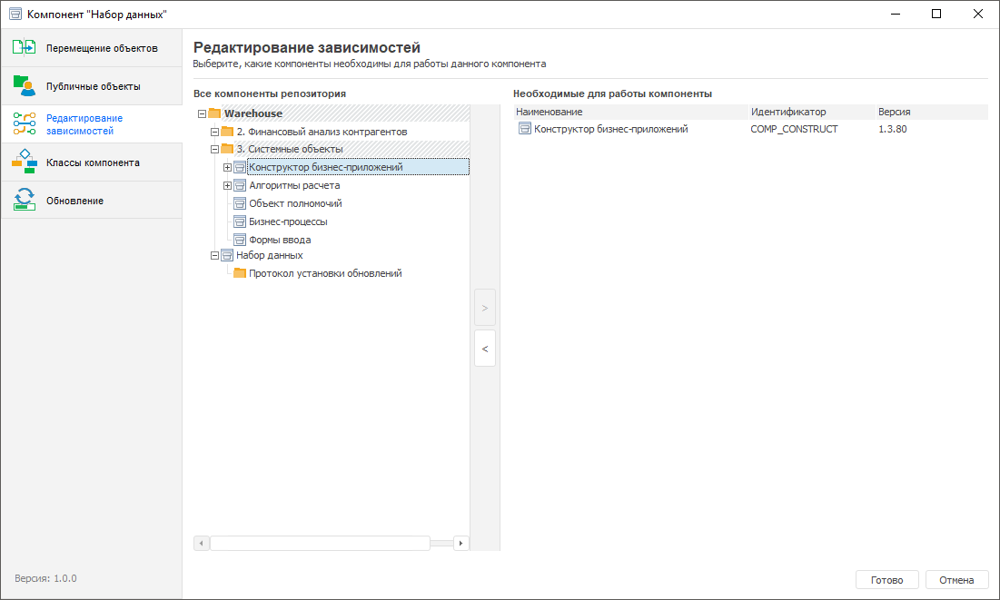

# Редактирование зависимостей: Компонент, настольное приложение

Редактирование зависимостей: Компонент, настольное приложение
-

# Редактирование зависимостей

Редактирование зависимостей пользовательского компонента от используемых
 системных компонентов продукта «Форсайт. Аналитическая платформа»
 необходима для обеспечения его стабильной работы при обновлении версий
 компонентов продукта «Форсайт. Аналитическая платформа».

Перечень необходимых системных компонентов зависит от используемых объектов
 в пользовательском компоненте. Например, если используются алгоритмы расчёта,
 то необходимым системным компонентом является «Алгоритмы
 расчёта». Системные компоненты также зависят друг от друга.
 Зависимость системных компонентов друг от друга описана в статье «[Установка
 расширений продукта «Форсайт. Аналитическая платформа](setup.chm::/Extensions/install_or_update_extensions.htm)».

Для редактирования зависимостей компонента выполните шаги:

	- Откройте компонент на редактирование:

		- нажмите кнопку  «Редактировать»
		 в группе «Открыть» на
		 вкладке «Главная» ленты
		 инструментов;

		- выполните команду «Редактировать»
		 в контекстном меню компонента;

		- нажмите клавишу F4.

	- В конструкторе компонентов перейдите в раздел  «Редактирование
	 зависимостей»:

		- в левой области окна «Все
		 компоненты репозитория» выделите курсором необходимый компонент
		 продукта «Форсайт. Аналитическая платформа»;

		- нажмите кнопку . Выбранный
		 компонент с указанием идентификатора и версии отобразится в правой
		 области окна «Необходимые для
		 работы компоненты».

Примечание.
 Необходимым системным компонентом для всех пользовательских компонентов
 является только «Конструктор бизнес-приложений»,
 который при настройке зависимостей по умолчанию выводится в области необходимых
 для работы компонентов.

	- Для сохранения настроек и выхода из конструктора нажмите кнопку
	 «Готово».

После редактирования зависимостей перейдите к [настройке
 публичных объектов](Setting_public_objects.htm).

См. также:

[Объединение
 функциональности в компоненты](Basic_properties_of_component.htm) | [Настройка
 публичных объектов](Setting_public_objects.htm)

		Справочная
		 система на версию 10.9
		 от 18/08/2025,
		 © ООО «ФОРСАЙТ»,
