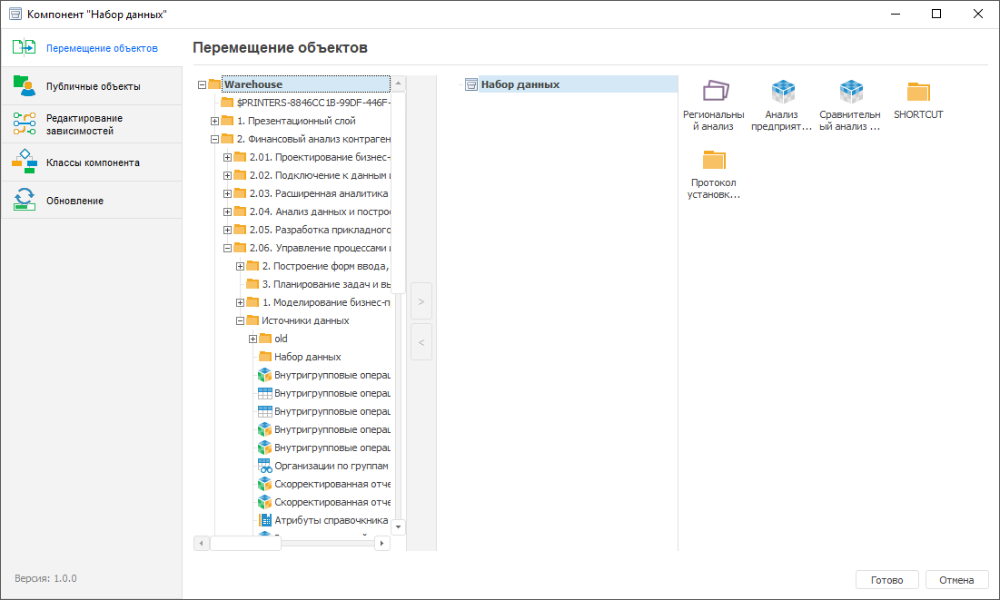

# Перемещение объектов в компонент: Компонент, настольное приложение

Перемещение объектов в компонент: Компонент, настольное приложение
-

# Перемещение объектов в компонент

Для добавления созданных объектов из [дерева папок репозитория](GetStarted.chm::/GetStarted/Repository.htm)
 в компонент выполните шаги:

	- Откройте компонент на редактирование:

		- нажмите кнопку  «Редактировать»
		 в группе «Открыть» на
		 вкладке «Главная» ленты
		 инструментов;

		- выполните команду «Редактировать»
		 в контекстном меню компонента;

		- нажмите клавишу F4.

	- В конструкторе компонента:

		- в разделе 
		 «Перемещение объектов»
		 в области с деревом папок репозитория выделите нужные папки/объекты
		 и переместите их в выбранную папку компонента с помощью механизма
		 Drag&Drop или кнопки ;

		- после подтверждения операции объекты будут перемещены из
		 репозитория в компонент.

Примечание.
 Для переноса многофункциональных объектов, например, [аналитических панелей](UIAdhoc.chm::/Launching.htm),
 [экспресс-отчётов](UIExpress.chm::/purpose/UiExpress_Organizational_Starting.htm)
 и других, перенесите во внутреннюю структуру компонента все используемые
 в них источники и объекты.

	- Для сохранения настроек и выхода из конструктора нажмите кнопку
	 «Готово».

После наполнения компонента объектами перейдите к [редактированию
 зависимостей](Configure_dependencies.htm) компонента.

См. также:

[Объединение
 функциональности в компоненты](Basic_properties_of_component.htm) | [Редактирование
 зависимостей](Configure_dependencies.htm)

		Справочная
		 система на версию 10.9
		 от 18/08/2025,
		 © ООО «ФОРСАЙТ»,
