# Формирование и установка обновлений: Компонент, настольное приложение

Формирование и установка обновлений: Компонент, настольное приложение
-

# Формирование и установка обновлений

	Формирование и установка обновлений производится с помощью файлов
	 в формате *.updpack. При формировании и установке пакетов обновлений
	 обеспечивается контроль целостности компонентов, созданных пользователями,
	 с учётом версий связанных системных компонентов продукта «Форсайт. Аналитическая платформа».

	При переносе пакета обновлений пользовательского компонента в другой
	 репозиторий, в котором не установлен данный компонент, выполняется
	 [первоначальная
	 установка компонента](Formation_installation_updates_components.htm#install_component_mng) с помощью менеджера репозитория. В дальнейшем
	 формирование и обновление версий установленных компонентов между репозиториями
	 выполняется в [конструкторе
	 компонентов](../Intro/Component_interface.htm#component).

	Таким образом, при создании пользовательского компонента выполняются
	 шаги:

		- Первоначальная [установка
		 расширения](Setup.chm::/Extensions/install_extensions_in_repository.htm) «Конструктор
		 бизнес-приложений» продукта «Форсайт. Аналитическая платформа»
		 в репозиторий разработки с помощью менеджера репозитория. После
		 установки расширения в репозитории будет установлен системный
		 компонент «Конструктор бизнес-приложений» с идентификатором
		 COMP_CONSTRUCT.

		- Создание компонента и [формирование
		 обновлений](Formation_installation_updates_components.htm#forming_updates_components) в репозитории разработки с помощью конструктора
		 компонентов.

		- Установки обновлений компонента:

			- в другой репозиторий, например, тестирования, в котором
			 не установлен данный компонент:

				- первоначальная [установка
				 расширения](Setup.chm::/Extensions/install_extensions_in_repository.htm) «Конструктор
				 бизнес-приложений» продукта «Форсайт. Аналитическая платформа»
				 в репозиторий тестирования с помощью менеджера репозитория;

				- первоначальная [установка
				 компонента](Formation_installation_updates_components.htm#install_component_mng) в репозиторий тестирования с помощью менеджера
				 репозитория;

			- в другой репозиторий, например, тестирования, в котором
			 уже установлен данный компонент:

				- [установка
				 обновлений компонента](Formation_installation_updates_components.htm#install_updates_components) в репозиторий тестирования с
				 помощью конструктора компонентов.

## Формирование обновлений
	 компонента

	Обновления компонента в формате *.updpack формируются в настольном
	 приложении.

	Для формирования обновлений компонента выполните шаги:

		- Откройте компонент на редактирование:

			- нажмите кнопку  «Редактировать»
			 в группе «Открыть»
			 на вкладке «Главная»
			 ленты инструментов;

			- выполните команду «Редактировать»
			 в контекстном меню компонента;

			- нажмите клавишу F4.

		- В конструкторе компонентов перейдите в раздел  «Обновление»:

			- в пункте «Формирование
			 обновления» нажмите кнопку «Сформировать».
			 Будет открыт мастер формирования обновлений.

	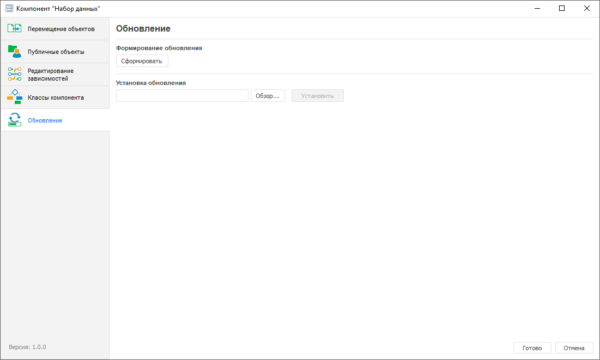

		- В мастере формирования обновлений задайте:

	[Базовые
	 свойства](javascript:TextPopup(this))

				- Задайте наименование обновления и версию для формируемого
				 пакета. Наименование обновления будет подставляться в
				 название файла с обновлением в формате *.updpack, номер
				 версии будет сравниваться с текущей версией.

		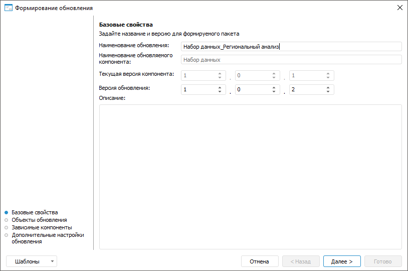

				- Перейдите к следующей странице мастера, нажав на кнопку
				 «Далее».

	[Объекты
	 обновления](javascript:TextPopup(this))

				- Выберите объекты, которые необходимо добавить в
				 обновление (минимально должен быть выделен один объект).

				- Для каждого выделенного объекта (группы объектов)
				 задайте при необходимости состав обновления:

					- только объект;

					- только права;

					- объект с правами доступа.

		По умолчанию установлен параметр
		 «Только объект».

		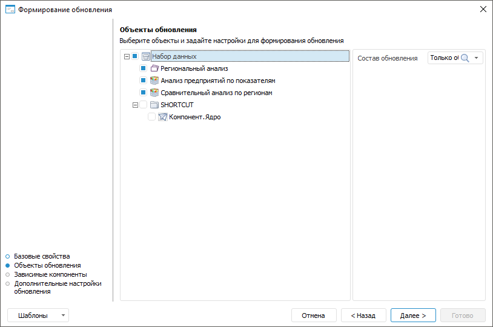

				- Перейдите к следующей странице мастера, нажав на
				 кнопку «Далее».

	[Зависимые
	 компоненты](javascript:TextPopup(this))

				- Отметьте зависимые компоненты, которые необходимо
				 добавить в обновление.

		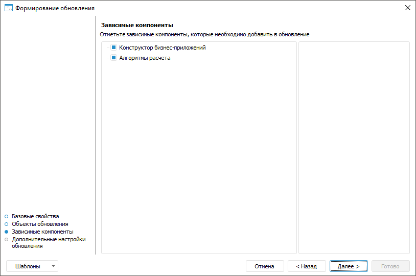

		Примечание.
		 Выводимый перечень зависимых компонентов определяется в разделе
		  «Редактирование зависимостей»
		 конструктора компонентов.

				- Перейдите к следующей странице мастера, нажав на
				 кнопку «Далее».

	[Дополнительные
	 настройки обновления](javascript:TextPopup(this))

		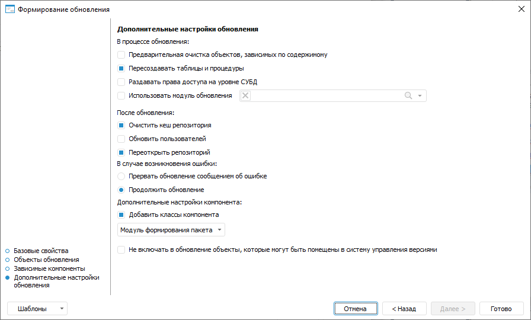

		Примечание.
		 Если обновление компонента выполняется из файла формата *.updpack,
		 используются параметры, заданные при [формировании
		 пакета обновления компонента](#forming_updates_components). Если обновление компонента выполняется
		 в составе [обновления репозитория](UpdManager.chm::/Admin_UpdateTitle.htm)
		 из [файла
		 формата *.pefx](UpdManager.chm::/SaveUpdate/Admin_SaveUpdate.htm#in_file), используются параметры, заданные
		 при формировании [обновления
		 репозитория](UpdManager.chm::/UpdateProcess_Parameters.htm).

				- Настройте дополнительные параметры обновления:

					- В процессе
					 обновления. Установите соответствующие флажки
					 для настройки процесса обновления:

						- Предварительная
						 очистка объектов, зависимых по содержимому.
						 По умолчанию флажок снят. В процессе обновления
						 зависимые объекты не очищаются. Установите флажок
						 для предварительной очистки зависимых объектов,
						 ссылающихся друг на друга;

						- Пересоздавать
						 таблицы и процедуры. По умолчанию флажок
						 установлен. В процессе обновления таблицы и процедуры
						 будут пересозданы на уровне СУБД. Снимите флажок
						 для пересоздания объектов только на уровне «Форсайт. Аналитическая платформа»;

						- Раздавать
						 права доступа на уровне СУБД. По умолчанию
						 флажок снят. В процессе обновления права будут
						 обновлены только на уровне «Форсайт. Аналитическая платформа».
						 Установите флажок для переноса и обновления прав
						 доступа на уровне СУБД;

						- Использовать
						 модуль обновления. По умолчанию флажок
						 снят. События, возникающие в процессе обновления,
						 отслеживаться не будут. Установите флажок для
						 отслеживания событий, возникающих в процессе обновления,
						 с помощью готового [модуля
						 обновления](UpdManager.chm::/CreateUpdate/Features/Admin_CreateUpdate_Features_Module.htm). Если флажок установлен,
						 активируется поле выбора готового модуля обновления;

					- После обновления.
					 Для настройки действий, которые необходимо выполнить
					 после обновления, установите соответствующие флажки:

						- Очистить
						 кеш репозитория. По умолчанию флажок установлен.
						 После обновления кеш репозитория будет очищен.
						 Снимите флажок, если очищение кеша репозитория
						 не требуется;

						- Обновить
						 пользователей. По умолчанию флажок снят.
						 После обновления пользователи не обновляются,
						 права переносятся со схемы, где был создан файл
						 обновления. Установите флажок, если права пользователей
						 или списки пользователей схемы-приёмника и схемы-источника
						 различаются. После установки обновления пользователи
						 будут обновлены;

						- Переоткрыть
						 репозиторий. По умолчанию флажок установлен.
						 После обновления будет отображено оповещение «После
						 установки обновлений требуется перезайти в репозиторий».
						 Перезапуск репозитория необходим, если в момент
						 обновления были открыты обновляемые объекты. Снимите
						 флажок для завершения обновления без отображения
						 оповещения;

					- В случае возникновения
					 ошибки. Для настройки действий, которые необходимо
					 выполнить в случае возникновения ошибки, установите
					 соответствующие флажки:

						- Прервать
						 обновление сообщением об ошибке. По умолчанию
						 переключатель выключен. Установка обновления не
						 будет прервана в случае возникновения ошибки.
						 Включите переключатель для прерывания обновления
						 в случае возникновения ошибки и отображения сообщения
						 об ошибке;

						- Продолжить
						 обновление. По умолчанию переключатель
						 включен. В случае возникновения ошибки обновление
						 будет продолжено без отображения сообщения об
						 ошибке. Выключите переключатель для прерывания
						 обновления в случае возникновения ошибки;

		Примечание.
		 В случае, когда ошибка связана с невозможностью обновления объекта,
		 сообщение об ошибке будет отображено даже при включенном переключателе
		 «Продолжить обновление».
		 После возникновения такой ошибки продолжить обновление можно,
		 отреагировав на сообщение.

					- Дополнительные
					 настройки компонента. Укажите дополнительные
					 параметры при необходимости:

						- Добавить
						 классы компонента. По умолчанию флажок
						 установлен. В обновление добавляются используемые
						 компонентом [классы
						 объектов](Adding_user_class.htm). Снимите флажок для исключения используемых
						 компонентом классов из обновления;

						- [Модуль
						 формирования пакета](Package_generation_module.htm). По умолчанию модуль
						 формирования пакета не выбран, события, возникающие
						 в процессе формирования обновления, не отслеживаются.
						 Выберите готовый модуль формирования пакета для
						 отслеживания событий, возникающих в процессе формирования
						 обновления. Для этого нажмите на кнопку «Модуль формирования
						 пакета». В открывшемся меню выполните команду
						 «Выбрать».
						 Откроется окно «Задать
						 обработчик». Выберите существующий модуль
						 и класс;

						- Не включать
						 в обновление объекты, которые могут быть помещены
						 в систему управления версиями. По умолчанию
						 флажок снят. В обновление включаются [объекты](UiDevEnv.chm::/01_Development_Environment/06_Version_Control_System/VSC_Introduction.htm),
						 которые могут быть помещены в систему управления
						 версиями. Установите флажок для исключения объектов,
						 параметры которых могут храниться в системе управления
						 версиями, из пакета обновления.

				- Завершите работу мастера, нажав на кнопку кнопку
				 «Готово».

	При необходимости настройки формирования
	 обновлений возможно сохранить в шаблон в формате *.xml для повторного
	 использования. В шаблон сохраняются: наименование обновления, список
	 всех объектов с установленным составом обновления и состояние отметки
	 (флажок установлен /не установлен), дополнительные настройки. В шаблон
	 не сохраняется состояние отметки по обновлению зависимых компонентов,
	 флажки установлены всегда по умолчанию. Нажмите на кнопку «Шаблоны»
	 и выберите из списка один из вариантов:

			- Сохранить в компонент.
			 При выборе данной команды файл с настройками обновления сохраняется
			 в компонент. Данные настройки будут автоматически применяться
			 при каждом последующем открытии мастера обновлений, пока не
			 будут удалены;

			- Удалить в компоненте.
			 При выборе данной команды файл с настройками обновления удаляется
			 в компоненте. Команда отображается в списке, если ранее было
			 выполнено сохранение шаблона в компонент;

			- Сохранить в файл.
			 При выборе данной команды файл с настройками обновления сохраняется
			 на локальном ресурсе;

			- Загрузить из файла.
			 При выборе данной команды указанный пользователем файл с настройками
			 обновления загружается с локального ресурса (однократно).
			 Для подтверждения применения настроек выводится информационное
			 сообщение.

	Если шаблон не применяется, то настройки
	 мастера формирования обновлений устанавливаются по умолчанию.

## Первоначальная установка компонента

	Для первоначальной установки пакета обновлений компонента в репозиторий,
	 в котором не установлен данный компонент, выполните шаги:

		- Запустите менеджер репозитория:

			- для запуска используйте ярлык, который создаётся в главном
			 меню Windows, или приложение RepoMngr.exe из папки установки
			 продукта «Форсайт. Аналитическая платформа»;

			- после запуска выберите пункт «Установка
			 расширений платформы»;

			- нажмите кнопку «Продолжить».

	

		- Выберите файл с пакетом обновлений приложения и укажите
		 репозиторий, в который будет установлен компонент.

	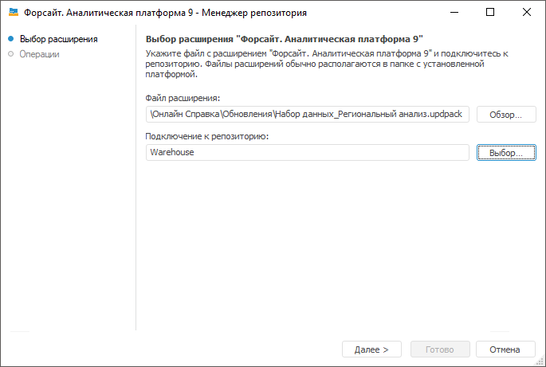

	При нажатии на кнопку «Далее»
	 будет произведена установка выбранного пакета обновлений для приложения.

	Примечание.
	 Подключение к репозиторию выполняйте от имени пользователя, являющегося
	 владельцем базы данных (схемы).

		- По завершению установки нажмите
		 кнопку «Готово».

	

	Примечание.
	 При наличии конфликтов при установке пакета обновлений попробуйте
	 установить его с помощью расширения «Конструктор
	 бизнес-приложений». Для этого откройте репозиторий, в который
	 происходит установка пакета, найдите объект «Конструктор бизнес-приложений»
	 с идентификатором COMP_CONSTRUCT, откройте его на редактирование и
	 выполните [установку
	 пакета обновлений](Formation_installation_updates_components.htm#install_updates_components).

## Установка обновлений компонента

	Установка обновлений компонента производится с помощью файлов в
	 формате *.updpack.

	Установить обновление можно в [настольном](#install_desktop)
	 и [веб-приложении](#install_web).

### Установка обновления в настольном
	 приложении

	Для формирования обновлений компонента выполните шаги:

		- Откройте компонент на редактирование:

			- нажмите кнопку  «Редактировать»
			 в группе «Открыть»
			 на вкладке «Главная»
			 ленты инструментов;

			- выполните команду «Редактировать»
			 в контекстном меню компонента;

			- нажмите клавишу F4.

		- В конструкторе компонентов перейдите в раздел  «Обновление»:

			- в пункте «Установка
			 обновления» нажмите кнопку «Обзор»,
			 выберите нужный файл с обновлением и нажмите кнопку «Установить».

		- После выбора файла будет открыто окно «Установка
		 обновления», в котором отображаются наименования обновления
		 и обновляемого компонента, номера текущей версии компонента и
		 его версии после установки обновления, а также наименования и
		 номера версий связанных компонентов, которые будут обновлены.
		 Нажмите кнопку «Установить»:

		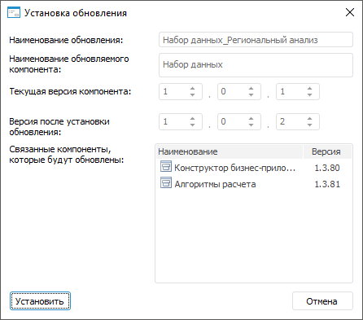

	Примечание.
	 Если номер устанавливаемой версии компонента будет ниже текущей, то
	 отобразится предупреждающий значок . Кнопка «Установить» будет не активна.
	В случае необходимости понижения текущей версии компонента, обратитесь
	 в [службу
	 технической поддержки](FAQ.chm::/FAQ_title.htm).

		- Будет открыто окно «Установка
		 обновления», в котором нажмите кнопку «Установить»:

	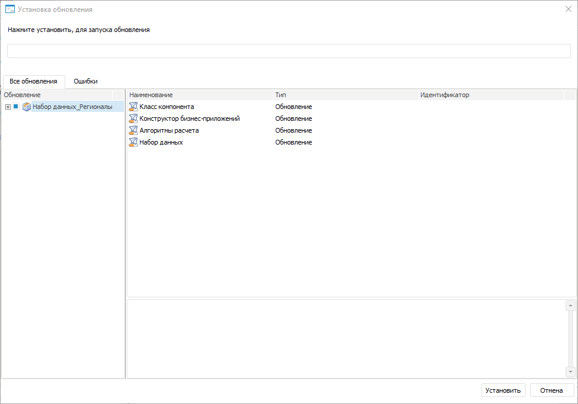

		- Начнется процесс установки обновлений, по окончании нажмите
		 кнопку «Готово»:

	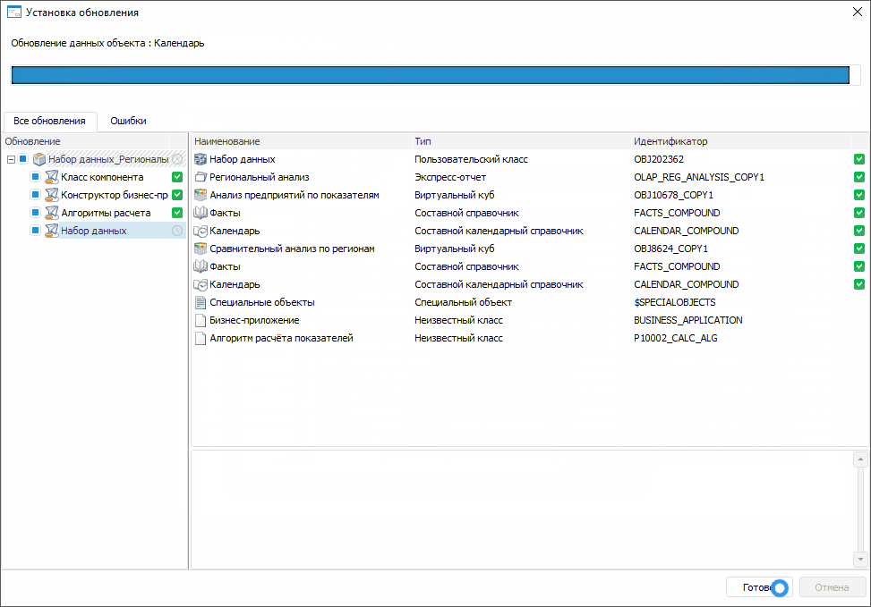

	Примечание.
	 При наличии ошибок перейдите на вкладку «Ошибки»
	 для детального просмотра. После доработки объектов компонента сформируйте
	 заново обновление и установите его.

		- После установки обновлений необходимо
		 закрыть и заново войти в репозиторий.

		- После установки обновлений в структуре
		 компонента будет создана папка «Протокол
		 установки обновлений», в которой размещаются текстовые
		 файлы с протоколом установки:

	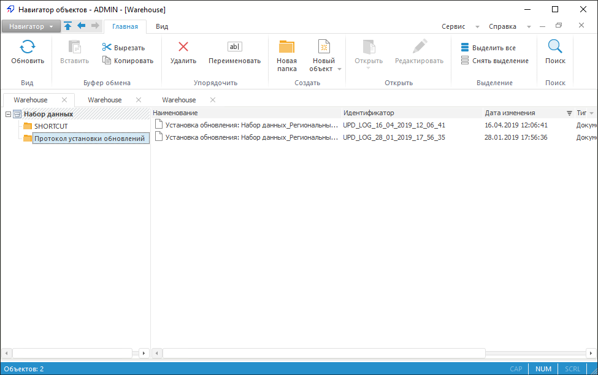

### Установка обновления в веб-приложении

	Для установки обновления компонента выполните шаги:

		- Откройте мастер обновлений одним из способов:

			- в  выполните команду главного
			 меню «Навигатор > Обновить
			 объекты репозитория»;

			- в  выполните команду главного
			 меню «Сервис > Менеджер обновлений >
			 Применить».

		- Выберите файл обновления. Для
		 этого нажмите кнопку «Обзор»,
		 будет открыт стандартный диалог выбора файла. Укажите путь к файлу обновления с
		 расширением *.updpack.

		- После выбора файла будет открыто окно «Установка
		 обновления», в котором отображаются наименования обновления
		 и обновляемого компонента, номера текущей версии компонента и
		 его версии после установки обновления, а также наименования и
		 номера версий связанных компонентов, которые будут обновлены.
		 Нажмите кнопку «Установить»:

	

	Будет открыто окно мастера обновления,
	 на котором расположено две страницы: «[Информация](UpdManager.chm::/Admin_UpMBObj_DoUpdateFile.htm)»
	 и «[Обновление](UpdManager.chm::/Admin_UpdateVersion.htm)»:

	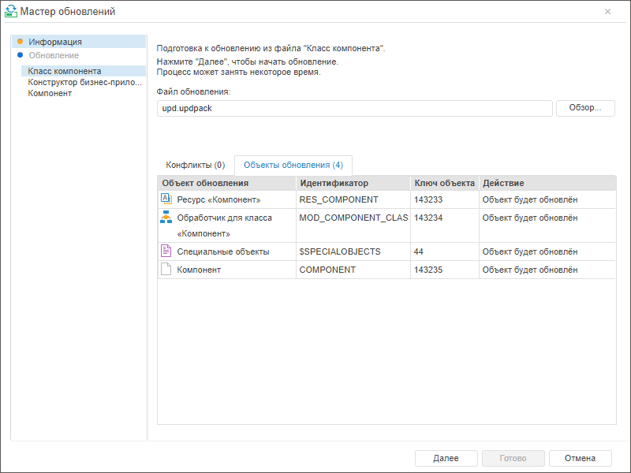

	Установка обновления с расширением *.updpack
	 в веб-приложении состоит из подготовки и установки отдельных файлов,
	 перечисленных на боковой панели мастера обновлений. На этапе подготовки
	 каждого из файлов на вкладке «Объекты
	 обновления» отображаются объекты, которые будут обновлены на
	 текущем этапе.

		- На странице «Информация»
		 нажмите «Далее» для установки
		 обновления из первого файла.

		- После запуска обновления из файла на странице «Обновление»
		 будет отображено текущее состояние процесса обновления:

	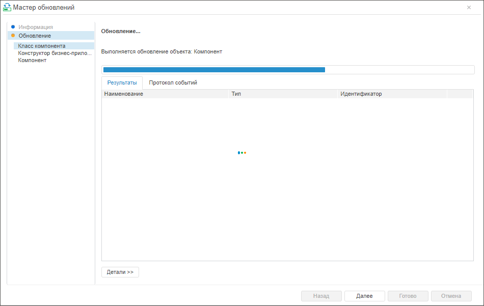

	После установки обновления из файла на
	 странице «Обновление» будет
	 выведено сообщение о завершении:

	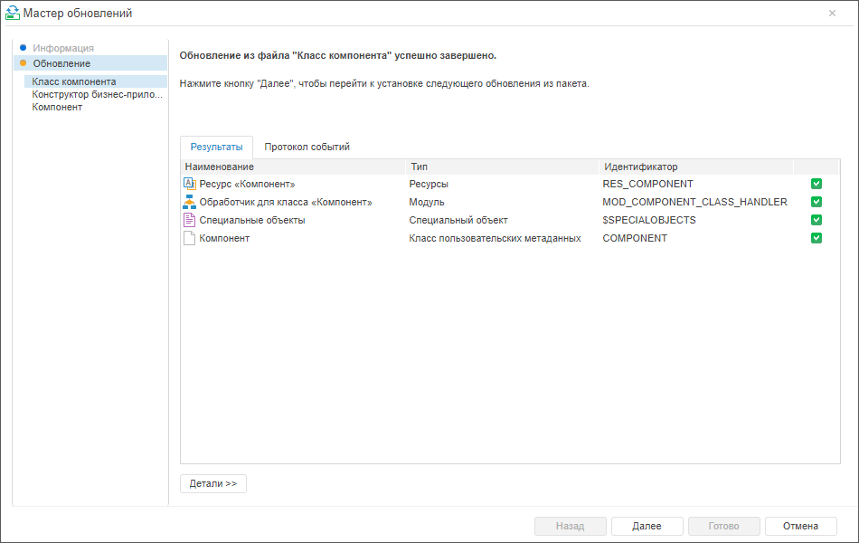

	После завершения обновления из файла
	 нажмите кнопку «Далее».

		- Повторите шаги 4-5 для остальных
		 файлов.

		- Нажмите кнопку «Готово»,
		 чтобы завершить работу мастера.

См. также:

[Объединение
 функциональности в компоненты](Basic_properties_of_component.htm)

		Справочная
		 система на версию 10.9
		 от 18/08/2025,
		 © ООО «ФОРСАЙТ»,
