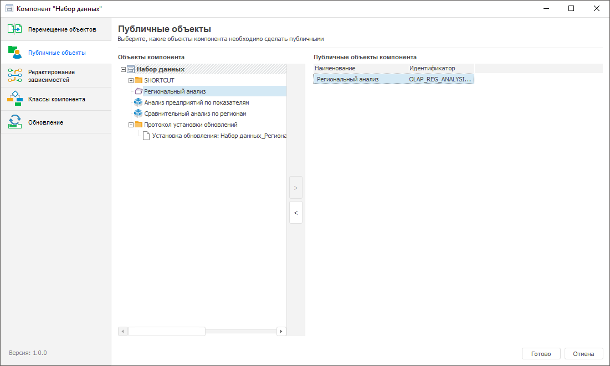

# Настройка публичных объектов: Компонент, настольное приложение

Настройка публичных объектов: Компонент, настольное приложение
-

# Настройка публичных объектов

Настройка публичных объектов позволяет определить общие объекты, используемые
 в разных бизнес-приложениях.

Для настройки публичных объектов компонента выполните шаги:

	- Откройте компонент на редактирование:

		- нажмите кнопку  «Редактировать»
		 в группе «Открыть» на
		 вкладке «Главная» ленты
		 инструментов;

		- выполните команду «Редактировать»
		 в контекстном меню компонента;

		- нажмите клавишу F4.

	- В конструкторе компонента перейдите в раздел  «Публичные объекты»:

		- в левой области окна «Объекты
		 компонента» выделите объект, который необходимо использовать
		 в разных бизнес-приложениях;

		- нажмите кнопку . Выбранный объект с
		 указанием идентификатора отобразится в правой области окна «Публичные объекты компонента».

	- Для сохранения настроек и выхода из конструктора нажмите кнопку
	 «Готово».

После настройки публичных объектов перейдите к [выбору
 используемых классов объектов](Adding_user_class.htm), которые относятся к данному компоненту.

См. также:

[Объединение
 функциональности в компоненты](Basic_properties_of_component.htm) | [Выбор
 используемых классов объектов](Adding_user_class.htm)

		Справочная
		 система на версию 10.9
		 от 18/08/2025,
		 © ООО «ФОРСАЙТ»,
