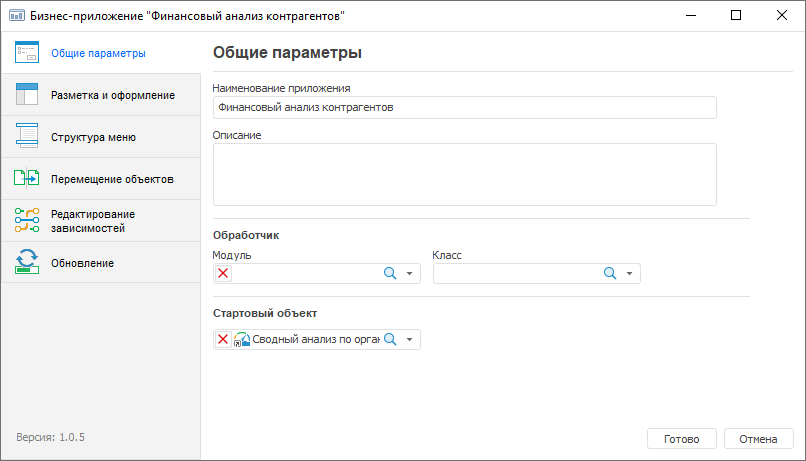

# Настройка общих параметров: Бизнес-приложение, настольное приложение

Настройка общих параметров: Бизнес-приложение, настольное приложение
-

# Настройка общих параметров

Настройка общих параметров бизнес-приложения выполняется на странице
 «Общие параметры» в [конструкторе
 бизнес-приложения](General_Principles.htm).

[Для открытия
 конструктора](javascript:TextPopup(this))

	Создайте или откройте готовое бизнес-приложение на редактирование.

	Для создания нового бизнес-приложения в [навигаторе
	 объектов](GetStarted.chm::/Interface/Interface_Navigator.htm) выполните одно из действий:

		- нажмите кнопку «Новый объект
		 > Пользовательские объекты > Бизнес-приложение» в
		 группе «Создать» на вкладке
		 «Главная» ленты инструментов;

		- выполните команду «Создать
		 > Пользовательские объекты > Бизнес-приложение» в
		 контекстном меню навигатора объектов.

	Для открытия готового бизнес-приложения на редактирование в [навигаторе
	 объектов](GetStarted.chm::/Interface/Interface_Navigator.htm) выделите бизнес-приложение и выполните
	 одно из действий:

	- нажмите кнопку  «Редактировать»
	 в группе «Открыть» на вкладке
	 «Главная» ленты инструментов;

	- выполните команду «Редактировать»
	 в контекстном меню бизнес-приложения;

	- нажмите клавишу F4.

Задайте параметры:

	- Наименование приложения.
	 Измените наименование бизнес-приложения при необходимости;

	- Описание. Введите текстовое
	 описание бизнес-приложения;

	- Обработчик. Настройте
	 обработчик событий:

		- Модуль. Выберите
		 в раскрывающемся списке модуль, написанный на языке Fore, для
		 выполнения действия при наступлении определенного события. Например,
		 при наступлении определённого события необходимо выводить информационное
		 сообщение. Модуль обрабатывается при открытии бизнес-приложения
		 и разрабатывается под потребности конкретного прикладного проекта
		 для расширения его функциональных возможностей. Модуль должен
		 быть предварительно создан и добавлен во [внутреннюю
		 структуру бизнес-приложения](../Web/Create_Internal_Structure_Business_Application.htm).

Пример модуля:

	Public Class BusinessApplicationEvents1: BusinessApplicationEvents

	    Public Sub OnAfterLogin(BP_IDENT: string);

	    Begin

	        Debug.WriteLine("OnAfterLogin");

	    End Sub OnAfterLogin;

	End Class BusinessApplicationEvents1;

		- Класс.
		 Выберите в раскрывающемся списке класс, наследуемый от класса
		 BusinessApplicationEvents и реализующий его события. Задаётся
		 прикладным разработчиком в модуле Fore.

Примечание.
 Обработка событий может настраиваться для различных объектов, например,
 в [регламентных
 отчётах](UiReport.chm::/desktop/Reports/Event/UiReport_Reports_Event.htm).

	- Стартовый объект. Выберите
	 в раскрывающемся списке «Объект»
	 ярлык на объект из [структуры
	 навигации](../Web/Setting_Navigation_Structure.htm), содержимое которого будет отображаться при открытии
	 бизнес-приложения в веб-интерфейсе. В качестве стартового объекта
	 может использоваться:

		- [Регламентный
		 отчёт](uireport.chm::/UiReport_purpose.htm);

		- [Экспресс-отчёт](uiexpress.chm::/purpose/UiExpress_Purpose.htm);

		- [Аналитическая
		 панель](uiadhoc.chm::/UiAdhoc_Purpose.htm).

Для сохранения заданных настроек нажмите кнопку «Готово».
 После нажатия на кнопку конструктор будет закрыт.

После настройки общих параметров создайте или измените [внутреннюю
 структуру бизнес-приложения](../Web/Create_Internal_Structure_Business_Application.htm) в [навигаторе
 объектов](GetStarted.chm::/Interface/Interface_Navigator.htm). Если бизнес-приложение открыто на редактирование,
 то перейдите к [настройке разметки и оформления](Layout_and_design.htm).

См. также:

[Построение
 бизнес-приложения в настольном приложении](General_Principles.htm) | [Создание
 внутренней структуры](../Web/Create_Internal_Structure_Business_Application.htm) | [Настройка разметки
 и оформления](Layout_and_design.htm)

		Справочная
		 система на версию 10.9
		 от 18/08/2025,
		 © ООО «ФОРСАЙТ»,
