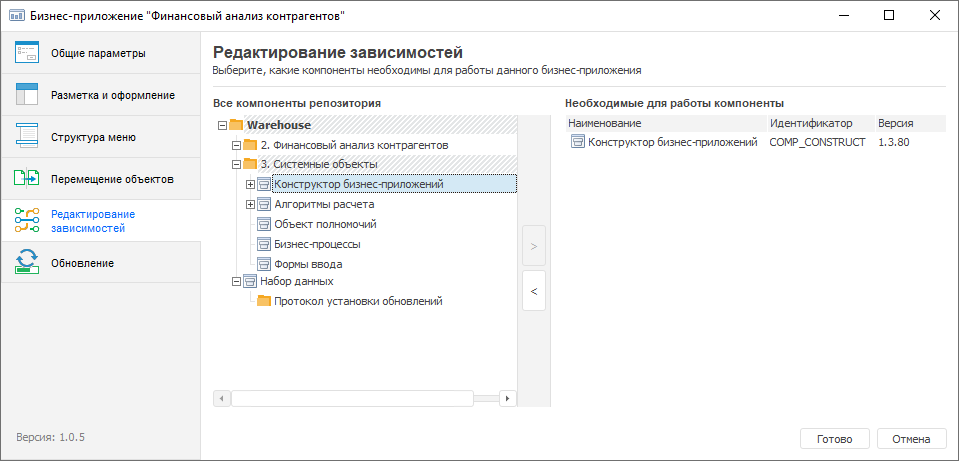

# Редактирование зависимостей: Бизнес-приложение, настольное приложение

Редактирование зависимостей: Бизнес-приложение, настольное приложение
-

# Редактирование зависимостей

Редактирование зависимостей объектов бизнес-приложения от используемых
 [расширений](setup.chm::/Extensions/install_or_update_extensions.htm)
 продукта «Форсайт. Аналитическая платформа»
 выполняется на странице «Структура меню»
 в [конструкторе бизнес-приложения](General_Principles.htm).
 Настроенные зависимости обеспечивают стабильную работу бизнес-приложения
 при [обновлении](setup.chm::/Extensions/Update/update_extensions.htm)
 используемых расширений. Зависимость системных компонентов друг от друга описана в статье «[Установка
 расширений продукта «Форсайт. Аналитическая платформа](setup.chm::/Extensions/install_or_update_extensions.htm)».

[Для открытия
 конструктора](javascript:TextPopup(this))

	- нажмите кнопку  «Редактировать»
	 в группе «Открыть» на вкладке
	 «Главная» ленты инструментов;

	- выполните команду «Редактировать»
	 в контекстном меню бизнес-приложения;

	- нажмите клавишу F4.

Перечень необходимых расширений зависит от используемых объектов в бизнес-приложении.
 Например, если используются алгоритмы расчёта, то необходимым расширением
 является «Алгоритмы расчёта».
 Расширения также зависят друг от друга.
 Для получения подробной информации о зависимости расширений друг от друга
 обратитесь к разделу [«Установка
 расширений «Форсайт. Аналитическая платформа»](setup.chm::/Extensions/install_or_update_extensions.htm).

Для редактирования зависимостей бизнес-приложения перенесите необходимые
 расширения из области «Все компоненты
 репозитория» в область «Необходимые
 для работы компоненты» с помощью кнопок  и . По умолчанию необходимым расширением для
 всех бизнес-приложений является «Конструктор
 бизнес-приложений».

После редактирования зависимостей объектов бизнес-приложения [сформируйте
 пакет обновлений](Formation_Installation_Updates.htm) для переноса бизнес-приложения в другой репозиторий.

См. также:

[Построение
 бизнес-приложения в настольном приложении](General_Principles.htm) | [Формирование
 и установка обновлений приложения](Formation_Installation_Updates.htm)

		Справочная
		 система на версию 10.9
		 от 18/08/2025,
		 © ООО «ФОРСАЙТ»,
