# Формирование и установка обновлений: Бизнес-приложение, настольное приложение

Формирование и установка обновлений: Бизнес-приложение, настольное приложение
-

# Формирование и установка обновлений

	Формирование и установка обновлений бизнес-приложений производится
	 с помощью файлов в формате *.updpack. При формировании и установке
	 пакетов обновлений бизнес-приложения обеспечивается контроль целостности
	 приложения с учётом версий связанных [расширений](setup.chm::/Extensions/install_or_update_extensions.htm)
	 продукта «Форсайт. Аналитическая платформа».

	При переносе пакета обновлений бизнес-приложения в другой репозиторий,
	 в котором не установлено данное приложение, выполняется [первоначальная
	 установка приложения](Formation_Installation_Updates.htm#install_updates_mng) с помощью менеджера репозитория. В дальнейшем
	 формирование и обновление версий установленных приложений между репозиториями
	 выполняется в [конструкторе бизнес-приложения](General_Principles.htm).

	Таким образом, при создании бизнес-приложения выполняются шаги:

		- Первоначальная [установка
		 расширения](Setup.chm::/Extensions/install_extensions_in_repository.htm) «Конструктор
		 бизнес-приложений» продукта «Форсайт. Аналитическая платформа»
		 в репозиторий разработки с помощью менеджера репозитория. После
		 установки расширения в репозитории будет установлен системный
		 компонент «Конструктор бизнес-приложений» с идентификатором
		 COMP_CONSTRUCT.

		- Создание приложения и [формирование
		 обновлений приложения](Formation_Installation_Updates.htm#forming-updates) в репозитории разработки с помощью конструктора
		 бизнес-приложения.

		- Установка обновлений бизнес-приложения:

			- в другой репозиторий, например, тестирования, в котором
			 не установлено данное приложение:

				- первоначальная [установка
				 расширения](Setup.chm::/Extensions/install_extensions_in_repository.htm) «Конструктор
				 бизнес-приложений» продукта «Форсайт. Аналитическая платформа»
				 в репозиторий с помощью менеджера репозитория;

				- первоначальная [установка
				 приложения](Formation_Installation_Updates.htm#install_updates_mng) в репозиторий с помощью менеджера репозитория;

			- в другой репозиторий, например, тестирования, в котором
			 уже установлено данное приложение:

				- [установка
				 обновлений приложения](Formation_Installation_Updates.htm#install_updates) в репозиторий с помощью конструктора
				 бизнес-приложения.

## Формирование обновлений бизнес-приложения

	Обновления бизнес-приложения в формате *.updpack формируются на
	 странице «Обновление» в [конструкторе бизнес-приложения](General_Principles.htm).

	[Для открытия
	 конструктора](javascript:TextPopup(this))

	- нажмите кнопку  «Редактировать»
	 в группе «Открыть» на вкладке
	 «Главная» ленты инструментов;

	- выполните команду «Редактировать»
	 в контекстном меню бизнес-приложения;

	- нажмите клавишу F4.

	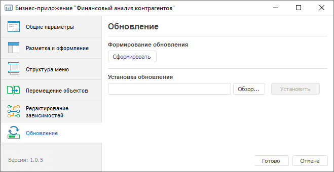

	Откройте мастер формирования обновлений с помощью кнопки «Сформировать» и задайте параметры:

	[Базовые
	 свойства](javascript:TextPopup(this))

			- Задайте наименование обновления и версию для формируемого
			 пакета. Наименование обновления будет подставляться в название
			 файла с обновлением в формате *.updpack, номер версии будет
			 сравниваться с текущей версией.

		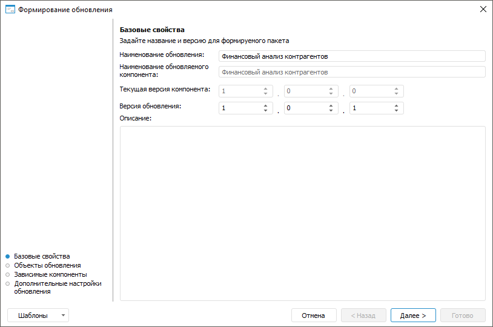

			- Перейдите к следующей странице мастера, нажав на кнопку
			 «Далее».

	[Объекты
	 обновления](javascript:TextPopup(this))

			- Выберите объекты, которые необходимо добавить в обновление
			 (минимально должен быть выделен один объект).

			- Для каждого выделенного объекта (группы объектов) задайте
			 при необходимости состав обновления:

				- только объект;

				- только права;

				- объект с правами доступа.

		По умолчанию установлен параметр
		 «Только объект».

		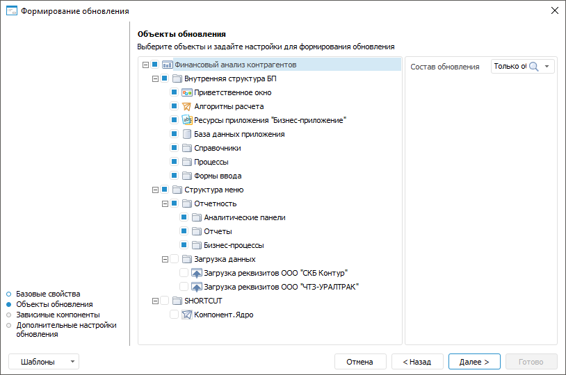

			- Перейдите к следующей странице мастера, нажав на кнопку
			 «Далее».

	[Зависимые
	 компоненты](javascript:TextPopup(this))

			- Отметьте зависимые компоненты, которые необходимо добавить
			 в обновление.

		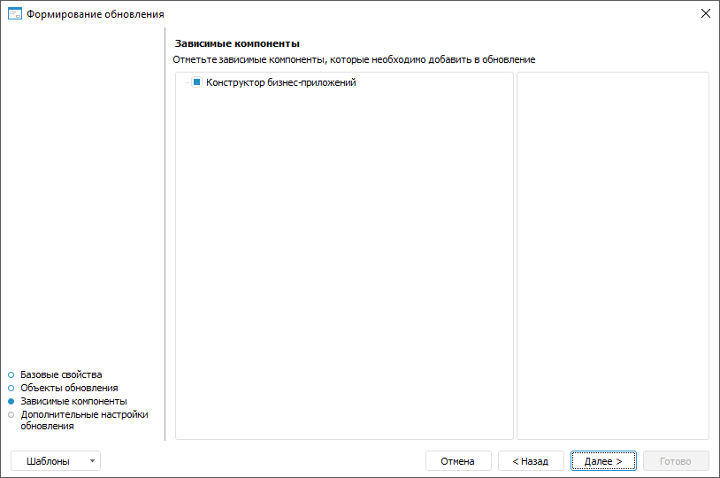

		Примечание.
		 Выводимый перечень зависимых компонентов определяется на странице
		 «[Редактирование
		 зависимостей](Edit_Dependencies.htm)» конструктора бизнес-приложения.

			- Перейдите к следующей странице мастера, нажав на кнопку
			 «Далее».

	[Дополнительные
	 настройки обновления](javascript:TextPopup(this))

		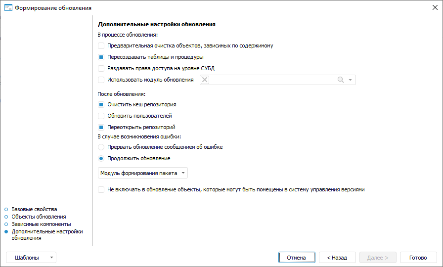

		Примечание.
		 Если обновление бизнес-приложения выполняется из файла формата
		 *.updpack, используются параметры, заданные при [формировании
		 пакета обновления бизнес-приложения](#forming-updates). Если обновление бизнес-приложения
		 выполняется в составе [обновления репозитория](UpdManager.chm::/Admin_UpdateTitle.htm)
		 из [файла
		 формата *.pefx](UpdManager.chm::/SaveUpdate/Admin_SaveUpdate.htm#in_file), используются параметры, заданные
		 при формировании [обновления
		 репозитория](UpdManager.chm::/UpdateProcess_Parameters.htm).

			- Настройте дополнительные параметры обновления:

				- В
				 процессе обновления. Установите соответствующие
				 флажки для настройки процесса обновления:

					- Предварительная
					 очистка объектов, зависимых по содержимому.
					 По умолчанию флажок снят. В процессе обновления зависимые
					 объекты не очищаются. Установите флажок для предварительной
					 очистки зависимых объектов, ссылающихся друг на друга;

					- Пересоздавать
					 таблицы и процедуры. По умолчанию флажок установлен.
					 В процессе обновления таблицы и процедуры будут пересозданы
					 на уровне СУБД. Снимите флажок для пересоздания объектов
					 только на уровне «Форсайт. Аналитическая платформа»;

					- Раздавать права
					 доступа на уровне СУБД. По умолчанию флажок
					 снят. В процессе обновления права будут обновлены
					 только на уровне «Форсайт. Аналитическая платформа».
					 Установите флажок для переноса и обновления прав доступа
					 на уровне СУБД;

					- Использовать
					 модуль обновления. По умолчанию флажок снят.
					 События, возникающие в процессе обновления, отслеживаться
					 не будут. Установите флажок для отслеживания событий,
					 возникающих в процессе обновления, с помощью готового
					 [модуля
					 обновления](UpdManager.chm::/CreateUpdate/Features/Admin_CreateUpdate_Features_Module.htm). Если флажок установлен,
					 активируется поле выбора готового модуля обновления;

				- После
				 обновления. Для настройки действий, которые необходимо
				 выполнить после обновления, установите соответствующие
				 флажки:

					- Очистить кеш
					 репозитория. По умолчанию флажок установлен.
					 После обновления кеш репозитория будет очищен. Снимите
					 флажок, если очищение кеша репозитория не требуется;

					- Обновить пользователей.
					 По умолчанию флажок снят. После обновления пользователи
					 не обновляются, права переносятся со схемы, где был
					 создан файл обновления. Установите флажок, если права
					 пользователей или списки пользователей схемы-приёмника
					 и схемы-источника различаются. После установки обновления
					 пользователи будут обновлены;

					- Переоткрыть
					 репозиторий. По умолчанию флажок установлен.
					 После обновления будет отображено оповещение «После
					 установки обновлений требуется перезайти в репозиторий».
					 Перезапуск репозитория необходим, если в момент обновления
					 были открыты обновляемые объекты. Снимите флажок для
					 завершения обновления без отображения оповещения;

				- В
				 случае возникновения ошибки. Для настройки действий,
				 которые необходимо выполнить в случае возникновения ошибки,
				 установите соответствующие флажки:

					- Прервать обновление
					 сообщением об ошибке. По умолчанию переключатель
					 выключен. Установка обновления не будет прервана в
					 случае возникновения ошибки. Включите переключатель
					 для прерывания обновления в случае возникновения ошибки
					 и отображения сообщения об ошибке;

					- Продолжить
					 обновление. По умолчанию переключатель включен.
					 В случае возникновения ошибки обновление будет продолжено
					 без отображения сообщения об ошибке. Выключите переключатель
					 для прерывания обновления в случае возникновения ошибки;

		Примечание.
		 В случае, когда ошибка связана с невозможностью обновления объекта,
		 сообщение об ошибке будет отображено даже при включенном переключателе
		 «Продолжить обновление».
		 После возникновения такой ошибки продолжить обновление можно,
		 отреагировав на сообщение.

				- [Модуль
				 формирования пакета](../Component/Package_generation_module.htm). По умолчанию модуль формирования
				 пакета не выбран, события, возникающие в процессе формирования
				 обновления, не отслеживаются. Выберите готовый модуль
				 формирования пакета для отслеживания событий, возникающих
				 в процессе формирования обновления. Для этого нажмите
				 на кнопку «Модуль формирования
				 пакета». В открывшемся меню выполните команду «Выбрать». Откроется
				 окно «Задать обработчик».
				 Выберите существующий модуль и класс;

				- Не
				 включать в обновление объекты, которые могут быть помещены
				 в систему управления версиями. По умолчанию флажок
				 снят. В обновление включаются [объекты](UiDevEnv.chm::/01_Development_Environment/06_Version_Control_System/VSC_Introduction.htm),
				 которые могут быть помещены в систему управления версиями.
				 Установите флажок для исключения объектов, параметры которых
				 могут храниться в системе управления версиями, из пакета
				 обновления.

			- Завершите работу мастера, нажав на кнопку «Готово».

	При необходимости настройки формирования
	 обновлений возможно сохранить в шаблон в формате *.xml для повторного
	 использования. В шаблон сохраняются: наименование обновления, список
	 всех объектов с установленным составом обновления и состояние отметки
	 (флажок установлен /не установлен), дополнительные настройки. В шаблон
	 не сохраняется состояние отметки по обновлению зависимых компонентов,
	 флажки установлены всегда по умолчанию. Нажмите на кнопку «Шаблоны»
	 и выберите из списка один из вариантов:

		- Сохранить в бизнес-приложение.
		 При выборе данной команды файл с настройками обновления сохраняется
		 в бизнес-приложение. Данные настройки будут автоматически применяться
		 при каждом последующем открытии мастера обновлений, пока не будут
		 удалены;

		- Удалить в бизнес-приложении.
		 При выборе данной команды файл с настройками обновления удаляется
		 в бизнес-приложении. Команда отображается в списке, если ранее
		 было выполнено сохранение шаблона в бизнес-приложение;

		- Сохранить в файл.
		 При выборе данной команды файл с настройками обновления сохраняется
		 на локальном ресурсе;

		- Загрузить из файла.
		 При выборе данной команды указанный пользователем файл с настройками
		 обновления загружается с локального ресурса (однократно). Для
		 подтверждения применения настроек выводится информационное сообщение.

	Если шаблон не применяется, то настройки
	 мастера формирования обновлений устанавливаются по умолчанию.

## Первоначальная установка бизнес-приложения

	Для первоначальной установки пакета обновлений бизнес-приложения
	 в репозиторий, в котором не установлено данное бизнес-приложение,
	 выполните шаги:

		- Запустите менеджер репозитория:

			- для запуска используйте ярлык, который создаётся в главном
			 меню Windows, или приложение RepoMngr.exe из папки установки
			 продукта «Форсайт. Аналитическая платформа»;

			- после запуска выберите пункт «Установка
			 расширений платформы»;

			- нажмите на кнопку «Продолжить».

	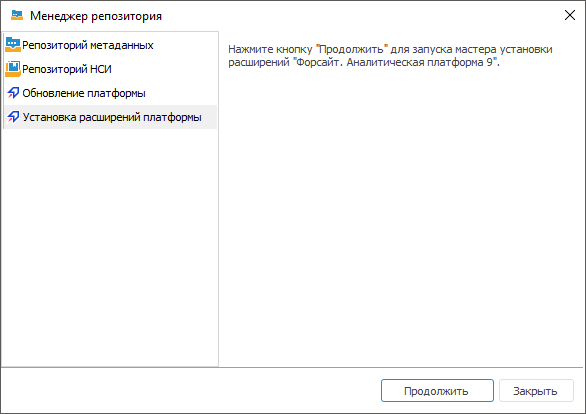

		- Выберите файл с пакетом обновлений приложения и укажите
		 репозиторий, в который будет установлено приложение.

		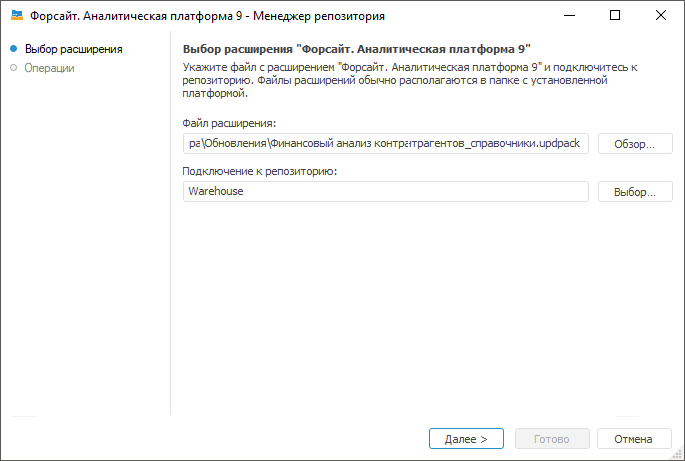

		При нажатии на кнопку «Далее»
		 будет произведена установка выбранного пакета обновлений для приложения.

	Примечание.
	 Подключение к репозиторию выполняйте от имени пользователя, являющегося
	 владельцем базы данных (схемы).

		- По завершению установки нажмите
		 кнопку «Готово».

	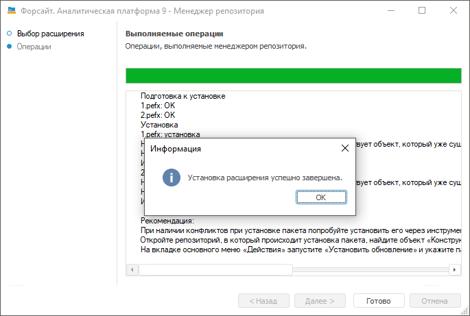

	Примечание.
	 При наличии конфликтов при установке пакета обновлений попробуйте
	 установить его с помощью расширения «Конструктор
	 бизнес-приложений». Для этого откройте репозиторий, в который
	 происходит установка пакета, найдите объект «Конструктор бизнес-приложений»
	 с идентификатором COMP_CONSTRUCT, откройте его на редактирование и
	 выполните [установку
	 пакета обновлений](../Component/Formation_installation_updates_components.htm#install_updates_components).

## Установка обновлений бизнес-приложения

	Установить обновление можно в [настольном](#install_desktop)
	 и [веб-приложении](#install_web).

### Установка обновления в настольном
	 приложении

	Для обновления версии ранее установленного бизнес-приложения выполните
	 шаги:

		- В [конструкторе бизнес-приложения](General_Principles.htm)
		 перейдите на страницу «Обновление»
		 и в разделе «Установка обновления»
		 нажмите кнопку «Обзор»,
		 выберите нужный файл с обновлением и нажмите кнопку «Установить».

		- После выбора файла будет открыто окно «Установка
		 обновления», в котором отображаются наименования обновления
		 и обновляемого бизнес-приложения, номера текущей версии бизнес-приложения
		 и его версии после установки обновления, а также наименования
		 и номера версий связанных компонентов, которые будут обновлены.
		 Нажмите кнопку «Установить»:

		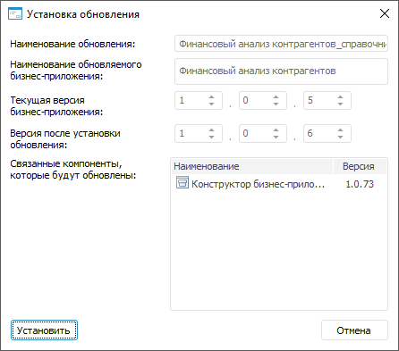

	Примечание.
	 Если номер устанавливаемой версии бизнес-приложения будет ниже текущей,
	 то отобразится предупреждающий значок . Кнопка
	 «Установить» будет не активна.

	В случае необходимости понижения текущей версии бизнес-приложения,
	 обратитесь в [службу
	 технической поддержки](FAQ.chm::/FAQ_title.htm).

		- Будет открыто окно «Установка
		 обновления», в котором нажмите кнопку «Установить»:

	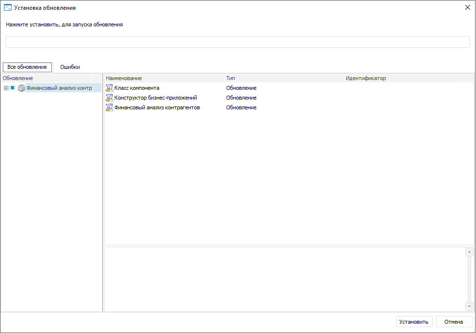

		- Начнется процесс установки обновлений, по окончании нажмите
		 кнопку «Готово»:

	

	Примечание.
	 При наличии ошибок перейдите на вкладку «Ошибки»
	 для детального просмотра. После доработки объектов бизнес-приложения
	 сформируйте заново обновление и установите его.

		- После установки обновлений необходимо
		 закрыть и заново войти в репозиторий.

		- После установки обновлений в структуре
		 бизнес-приложение будет создана папка «Протокол
		 установки обновлений», в которой размещаются текстовые
		 файлы с протоколом установки:

	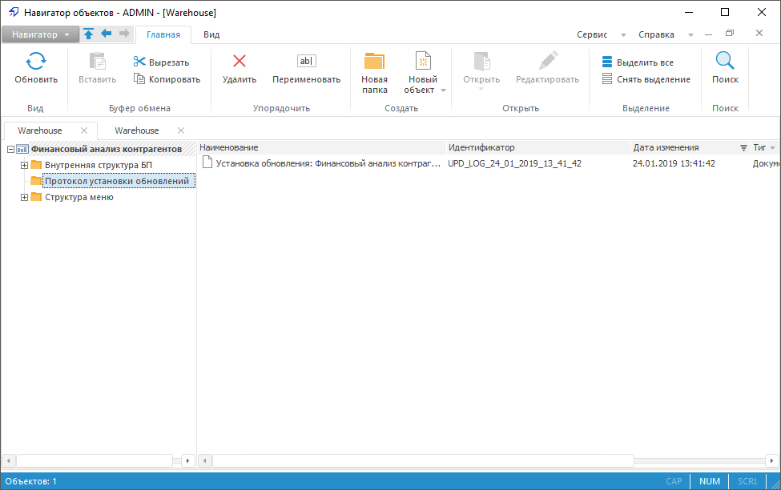

### Установка обновления в веб-приложении

	Для установки обновления приложения выполните шаги:

		- Откройте мастер обновлений одним из способов:

			- в  выполните команду главного
			 меню «Навигатор > Обновить
			 объекты репозитория»;

			- в  выполните команду главного
			 меню «Сервис > Менеджер обновлений >
			 Применить».

		- Выберите файл обновления. Для
		 этого нажмите кнопку «Обзор»,
		 будет открыт стандартный диалог выбора файла. Укажите путь к файлу обновления с
		 расширением *.updpack.

		- После выбора файла будет открыто окно «Установка
		 обновления», в котором отображаются наименования обновления
		 и обновляемого компонента, номера текущей версии компонента и
		 его версии после установки обновления, а также наименования и
		 номера версий связанных компонентов, которые будут обновлены.
		 Нажмите кнопку «Установить»:

	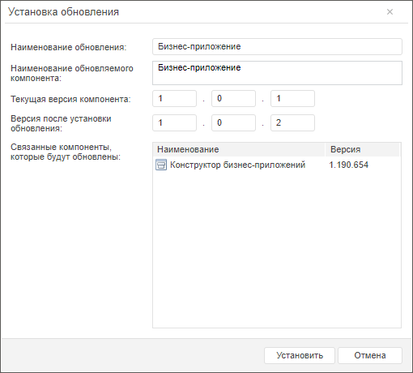

	Будет открыто окно мастера обновления,
	 на котором расположено две страницы: «[Информация](UpdManager.chm::/Admin_UpMBObj_DoUpdateFile.htm)»
	 и «[Обновление](UpdManager.chm::/Admin_UpdateVersion.htm)»:

	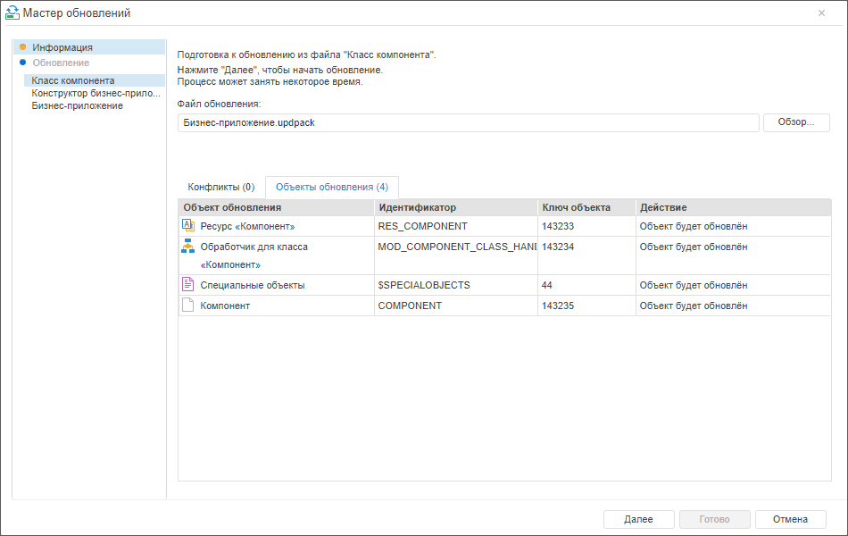

	Установка обновления с расширением *.updpack
	 в веб-приложении состоит из подготовки и установки отдельных файлов,
	 перечисленных на боковой панели мастера обновлений. На этапе подготовки
	 каждого из файлов на вкладке «Объекты
	 обновления» отображаются объекты, которые будут обновлены на
	 текущем этапе.

		- На странице «Информация»
		 нажмите кнопку «Далее»
		 для установки обновления из первого файла.

		- После запуска обновления из файла на странице «Обновление»
		 будет отображено текущее состояние процесса обновления:

	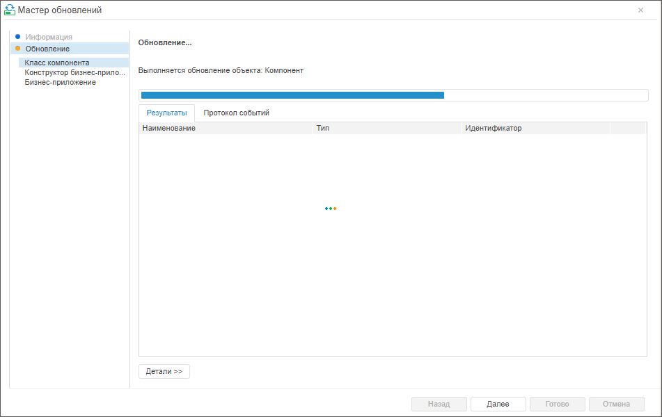

	После установки обновления из файла на
	 странице «Обновление» будет
	 выведено сообщение о завершении:

	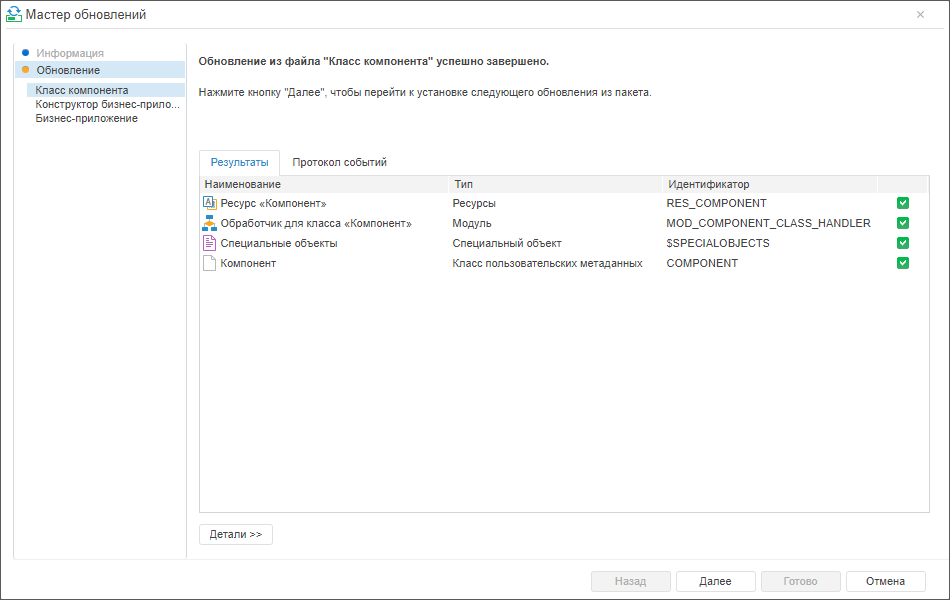

	После завершения обновления из файла
	 нажмите кнопку «Далее».

		- Повторите шаги 4-5 для остальных
		 файлов.

		- Нажмите кнопку «Готово»,
		 чтобы завершить работу мастера.

См. также:

[Построение
 бизнес-приложения в настольном приложении](General_Principles.htm) | [Модуль
 формирования пакета](../Component/Package_generation_module.htm)

		Справочная
		 система на версию 10.9
		 от 18/08/2025,
		 © ООО «ФОРСАЙТ»,
