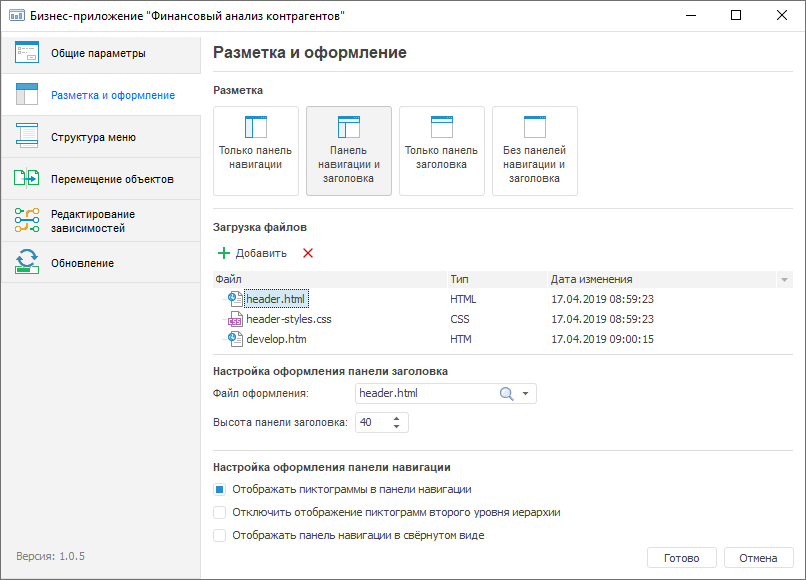
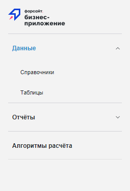
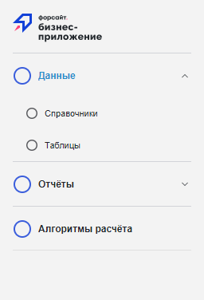
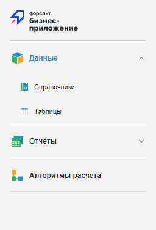
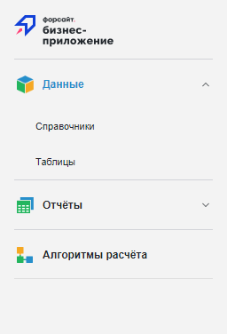
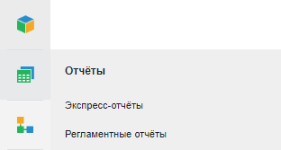
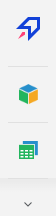
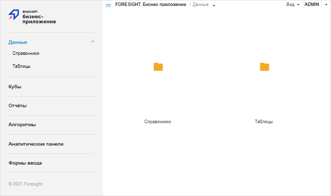
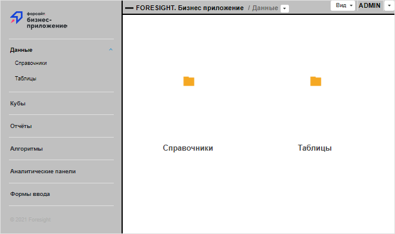

# Настройка разметки и оформления: Бизнес-приложение, настольное приложение

Настройка разметки и оформления: Бизнес-приложение, настольное приложение
-

# Настройка разметки и оформления

	Настройка разметки и оформления бизнес-приложения выполняется на
	 странице «Разметка и оформление»
	 в [конструкторе бизнес-приложения](General_Principles.htm).

	[Для открытия
	 конструктора](javascript:TextPopup(this))

	- нажмите кнопку  «Редактировать»
	 в группе «Открыть» на вкладке
	 «Главная» ленты инструментов;

	- выполните команду «Редактировать»
	 в контекстном меню бизнес-приложения;

	- нажмите клавишу F4.

	

	Настройте отображение панели навигации и панели заголовка в разделе
	 «Разметка»:

		- Только панель навигации.
		 По умолчанию;

		- Панель навигации и заголовка.
		 Для оформления панели заголовка используйте файлы в форматах JS,
		 CSS, HTML;

		- Только панель заголовка.
		 Для оформления панели заголовка используйте файлы в форматах JS,
		 CSS, HTML;

		- Без панелей навигации и
		 заголовка. Отключение отображения панели навигации и заголовка.
		 Навигация по элементам осуществляется с помощью [навигационного
		 меню](../Intro/Component_interface.htm).

	Примечание.
	 Панель заголовка доступна только в ОС Windows.

	Для бизнес-приложения доступны следующие настройки оформления:

		- [настройка оформления панели
		 заголовка](#title_panel_design);

		- [настройка оформления
		 панели навигации](#navigation_panel_design);

		- [общая настройка оформления
		 бизнес-приложения](#extended_custom_design).

	Примечание.
	 Настройка оформления панели заголовка также возможна и при общей настройке
	 оформления бизнес-приложения с помощью файла в формате CSS. Однако
	 следует учитывать, что при подключении CSS-файла на странице «Разметка и оформление» пользовательское
	 оформление будет применено только для настраиваемого бизнес-приложения,
	 а при подключении через файл [DBA.config.json](Setup.chm::/Extensions/Configuration_Designer_of_Business_Applications.htm#dba_config_json)
	 пользовательское оформление будет применено для всех бизнес-приложений
	 в репозитории.

	Файлы, загруженные для настройки разметки и оформления панелей в
	 бизнес-приложении, при необходимости могут использоваться в качестве
	 внешнего обработчика событий. Внешний обработчик событий наступает
	 при закрытии объекта, входящего в состав бизнес-приложения, и задаётся
	 в поле onCloseQuery в файле
	 [DBA.config.json](Setup.chm::/Extensions/Configuration_Designer_of_Business_Applications.htm#dba_config_json).

	После настройки разметки и оформления бизнес-приложения перейдите
	 к [настройке структуры
	 меню](Setting_web_application_structure.htm).

## Настройка оформления панели заголовка

	Для настройки оформления панели заголовка:

		- Выберите один из вариантов разметки в разделе «Разметка»:

			- Панель навигации и
			 заголовка;

			- Только панель заголовка.

		- Добавьте файлы с оформлением панели заголовка в форматах
		 JS, CSS, HTM/HTML в разделе «Загрузка
		 файлов».

	Примечание.
	 В списке загруженных файлов может быть несколько вариантов оформления
	 заголовка.

		- Задайте параметры в разделе «Настройка
		 оформления панели заголовка»:

			- Файл оформления.
			 Выберите в раскрывающемся списке один из добавленных файлов
			 с настройкой оформления панели;

			- Высота панели заголовка.
			 Укажите высоту панели заголовка в пикселях.

	После выполнения действий при [открытии](../Intro/Component_interface.htm#open)
	 бизнес-приложения в веб-интерфейсе будет отображаться панель заголовка
	 с настроенным оформлением.

	Для сохранения заданных настроек нажмите кнопку «Готово».
	 После нажатия на кнопку конструктор будет закрыт.

## Настройка оформления панели
	 навигации

	Для настройки оформления панели навигации:

		- Выберите один из вариантов разметки в разделе «Разметка»:

			- Только панель навигации;

			- Панель навигации и
			 заголовка.

		- Задайте параметры в разделе «Настройка
		 оформления панели навигации»:

			- Отображать
			 пиктограммы в панели навигации. Установите флажок для
			 загрузки и отображения пиктограмм элементов меню на панели
			 навигации. При изменении состояния флажка выводится информационное
			 окно с сообщением об изменении режима отображения панели навигации
			 и с рекомендацией о проверке актуальности подключённых файлов
			 стилей. Проверка актуальна только в ОС Windows. По умолчанию
			 флажок снят.

	При установленном флажке доступна загрузка
	 пиктограмм для каждого элемента меню в разделе «[Оформление](Setting_web_application_structure.htm#load_img)»
	 на странице «Структура меню»
	 конструктора бизнес-приложения. Пиктограммы могут загружаться только
	 для элементов меню первого и второго уровней структуры навигации.
	 Если для элемента не загружена пользовательская пиктограмма, то будет
	 отображаться [пиктограмма
	 по умолчанию](Setting_web_application_structure.htm#load_img);

			- Отключить
			 отображение пиктограмм второго уровня иерархии. Установите
			 флажок для отображения пиктограмм элементов меню, расположенных
			 только на первом уровне структуры навигации. По умолчанию
			 флажок снят и доступен при установленном флажке «Отображать
			 пиктограммы в панели навигации»;

			- Отображать панель навигации
			 в свёрнутом виде. Установите флажок для скрытия панели
			 навигации при [открытии](../Intro/Component_interface.htm#open)
			 бизнес-приложения в веб-интерфейсе. В свёрнутом виде на панели
			 навигации отображаются только пиктограммы элементов меню первого
			 уровня. Для управления отображением панели навигации используйте
			 кнопки  «Развернуть
			 панель»,  «Свернуть
			 панель» в навигационном меню. По умолчанию флажок снят
			 и доступен при установленном флажке «Отображать
			 пиктограммы в панели навигации».

	Для доступа к элементам меню второго
	 уровня при свёрнутой панели навигации наведите курсор на пиктограмму
	 требуемого элемента первого уровня, после чего появится всплывающая
	 панель с его дочерними элементами. Отображение пиктограмм элементов
	 второго уровня на всплывающей панели зависит от состояния флажка «Отключить отображение пиктограмм второго
	 уровня иерархии».

	После выполнения действий при [открытии](../Intro/Component_interface.htm#open)
	 бизнес-приложения в веб-интерфейсе будет отображаться панель навигации
	 с настроенным оформлением.

	Для сохранения заданных настроек нажмите кнопку «Готово».
	 После нажатия на кнопку конструктор будет закрыт.

	[Примеры
	 отображения панели навигации в ОС Windows](javascript:TextPopup(this))

		Стандартное отображение панели навигации:

		

		При установке флажка «Отображать
		 пиктограммы в панели навигации» на панели навигации будут
		 отображаться пиктограммы элементов по умолчанию:

		

		При задании пользовательских пиктограмм панель навигации примет
		 следующий вид:

		

		При установке флажка «Отключить
		 отображение пиктограмм второго уровня иерархии» элементы
		 второго уровня на панели навигации будут отображаться без пиктограмм:

		

		При сворачивании панели навигации или при установке флажка «Отображать панель навигации в свёрнутом
		 виде» на панели навигации будут отображаться только пиктограммы
		 первого уровня:

		

		При наведении курсора на пиктограмму элемента свёрнутой панели
		 навигации отобразится всплывающая панель с его дочерними элементами:

		

		Если размер окна, в котором открыто бизнес-приложение, недостаточен
		 для отображения всех элементов меню, то на панели навигации появятся
		 кнопки для прокрутки:

		

## Настройка оформления бизнес-приложения

	Примечание.
	 Актуально только для [открытия](../Intro/Component_interface.htm#open)
	 бизнес-приложения в ОС Windows.

	Для настройки оформления бизнес-приложения доступно изменение следующих
	 элементов:

		- элементы интерфейса без
		 пиктограмм. Формат отображения панели навигации, формат
		 отображения панели заголовка, содержание, цвета, размеры и шрифты
		 различных надписей, цвет фона бизнес-приложения, а также оформление
		 иных элементов интерфейса, не связанных с изображениями или пиктограммами
		 объектов, задаются через файл в формате CSS. Для настройки оформления
		 бизнес-приложения через CSS-файл:

			- Создайте CSS-файл с пользовательскими
			 настройками оформления в папке «S\assets», где S - папка [установки](Setup.chm::/Extensions/ASP_NET/Install_Backend_Designer_of_Business_Applications_ASP_NET.htm)
			 конструктора бизнес-приложений;

			- Подключите пользовательский
			 CSS-файл в бизнес-приложение. Для этого откройте на редактирование
			 файл [DBA.config.json](Setup.chm::/Extensions/Configuration_Designer_of_Business_Applications.htm#dba_config_json),
			 расположенный в папке «S\config», где S - папка установки
			 конструктора бизнес-приложений, и добавьте в него следующую
			 настройку:

"externalCss":["assets/<наименование CSS-файла>.css"]

	После выполнения действий будет задано
	 пользовательское оформление для всех бизнес-приложений в репозитории.

	[Пример
	 настройки оформления при помощи CSS-файла](javascript:TextPopup(this))

		Пример файла в формате CSS с пользовательскими
		 настройками оформления:

/* Настройки отображения объектов в навигаторе объектов */

.PPNavigatorBox .Content {
    font-size: 16px !important; /* размер шрифта */
    font-weight: bold; /* жирное начертание */
}

/* Настройки отображения активных пунктов на боковой панели */

.nav_item .nav__item--active .nav__title[_ngcontent-c9], .nav_item .nav__item--active .nav__title[_ngcontent-c11] {
    font-weight: bold !important; /* начертание */

    color: #000000 !important; /* цвет шрифта */

}

/* Настройки бокового меню */

.page .page__side {
    border-right: 2px solid #000000; /* цвет и толщина границы */

    background-color: #c0c0c0 !important; /* цвет фона */

}

/* Настройки панели заголовка */

.page .head {
    border-bottom: 2px solid #000000; /* цвет и толщина границы */

    background-color: #c0c0c0 !important; /* цвет фона */

    font-size: 14px !important; /* размер шрифта */

    font-weight: bold; /* начертание */

    color: #000000; /* цвет шрифта */

}

/* Настройки кнопки для скрытия/раскрытия бокового меню */

.page .trigger-aside {
    position: relative;
    width: 24px; /* ширина */

    height: 24px; /* высота */

    color: #000000 !important; /* цвет кнопки */

    padding: 0;
}
.page .trigger-aside__line {
    width: 18px; /* ширина линии */

    height: 2px; /* высота линии */

    position: absolute;
    top: 7px;
    left: 50%;
    margin-left: -7px;
}
		Пример файла DBA.config.json с подключённым
		 CSS-файлом:

{
  "targetRepo": "TEST_REPOSITORY",
  "targetApp": "TEST_APP",
  "ppServiceUrl": "http://SampleServer/FPBI_App_v10.x/axis2/services/PP.SOM.Som",

  "locale": ["ru"],
  "repositories": {
    "TEST_REPOSITORY": {
      "repoIdent": "TEST_REPOSITORY",
      "apps": {
        "TEST_APP": {
          "appIdent": "TEST_APP",
          "breadcrumbRootTitle": "FORESIGHT. Бизнес приложение",
          "mainMenuLogo": "assets/design/img/PPlogo_sm.png",
          "pageMetadataLogo": "assets/design/img/PPlogo.png"
        }
      }
    }
  },
  "externalCss":["assets/user_design.css"]
}
		Оформление бизнес-приложения до подключения
		 описанного CSS-файла:

		

		Оформление бизнес-приложения после
		 подключения описанного CSS-файла:

		

		- пиктограммы и логотипы.
		 Пиктограммы и логотипы бизнес-приложения задаются в формате изображений
		 в папке установки конструктора бизнес-приложений. Для настройки
		 доступны следующие пиктограммы и логотипы:

			- логотип бизнес-приложения.
			 Для задания нового логотипа бизнес-приложения измените файл
			 favicon.ico, расположенный в папке установки конструктора
			 бизнес-приложений;

			- логотип
			 на стартовой странице. Для задания нового логотипа
			 бизнес-приложения на стартовой странице откройте файл DBA.config.json
			 на редактирование и измените в нём следующую настройку:

"pageMetadataLogo": "assets/design/img/<наименование PNG-файла>.png"

			- логотип на панели заголовка
			 при развёрнутом боковом меню. Для задания нового логотипа
			 бизнес-приложения на панели заголовка при отображении бокового
			 меню в развёрнутом виде откройте файл DBA.config.json на редактирование
			 и измените в нём следующую настройку:

"mainMenuLogo": "assets/design/img/<наименование PNG-файла>.png"

			- логотип на панели заголовка
			 при свёрнутом боковом меню. Для задания нового логотипа
			 бизнес-приложения на панели заголовка при отображении бокового
			 меню в свёрнутом виде откройте файл DBA.config.json на редактирование
			 и измените в нём следующую настройку:

"mainMenuLogoMini": "assets/design/img/<наименование PNG-файла>.png"

			- пиктограммы стандартных
			 классов. Для задания новых пиктограмм стандартных классов
			 бизнес-приложения измените файлы glbClsImg16.png, glbClsImg16.retina.png
			 и glbClsImg32.png, расположенные в папке «S\assets\platform_modules\build\img\metabase»,
			 где S - папка установки конструктора бизнес-приложений;

	Примечание.
	 Пиктограммы пользовательских классов недоступны для редактирования.

		- название бизнес-приложения.
		 Для задания нового заголовка вкладки бизнес-приложения откройте
		 файл DBA.config.json на редактирование и измените в нём следующую
		 настройку:

"breadcrumbRootTitle": "<название вкладки бизнес-приложения>"

См. также:

[Построение
 бизнес-приложения в настольном приложении](General_Principles.htm) | [Настройка
 структуры меню](Setting_web_application_structure.htm)

		Справочная
		 система на версию 10.9
		 от 18/08/2025,
		 © ООО «ФОРСАЙТ»,
