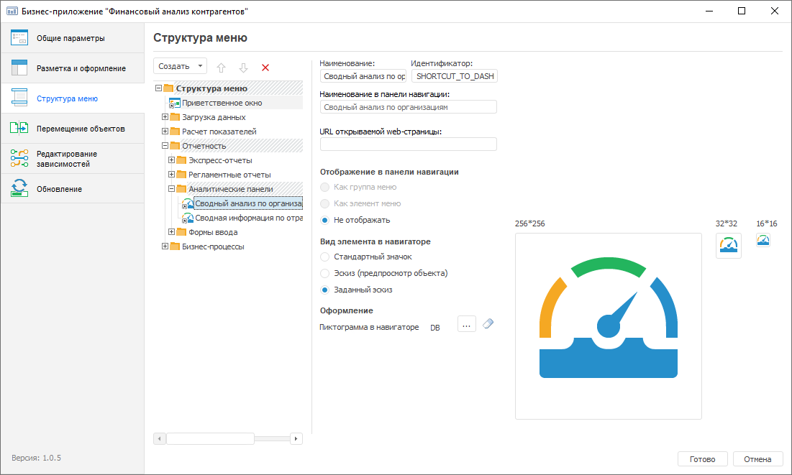
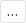
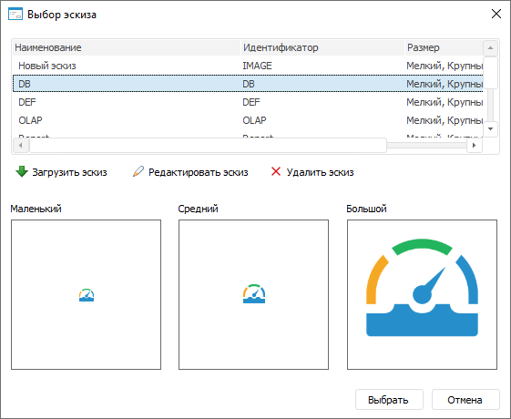
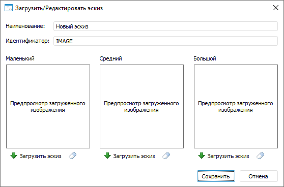

# Настройка структуры меню: Бизнес-приложение, настольное приложение

Настройка структуры меню: Бизнес-приложение, настольное приложение
-

# Настройка структуры меню

Настройка структуры меню на [панели
 навигации](../Intro/Component_interface.htm) выполняется на странице «Структура
 меню» в [конструкторе бизнес-приложения](General_Principles.htm).

[Для открытия
 конструктора](javascript:TextPopup(this))

	- нажмите кнопку  «Редактировать»
	 в группе «Открыть» на вкладке
	 «Главная» ленты инструментов;

	- выполните команду «Редактировать»
	 в контекстном меню бизнес-приложения;

	- нажмите клавишу F4.

В левой части страницы содержится иерархия элементов меню, которая будет
 отображаться на панели навигации. К элементам меню относятся папки и ярлыки
 на объекты, содержащиеся во [внутренней
 структуре бизнес-приложения](../Web/Create_Internal_Structure_Business_Application.htm).

Сформируйте структуру меню:

[Добавление
 папки](javascript:TextPopup(this))

	Для добавления папки в структуру меню:

		- Выделите корневую папку «Структура
		 меню» или дочерний элемент, в который будет добавлена папка.

		- Нажмите кнопку «Создать
		 > Добавить пункт меню».

	После выполнения действий будет добавлена папка в структуру меню.

	Примечание.
	 Иерархия дочерних элементов может быть любого уровня вложенности,
	 но на панели навигации используется только двухуровневая структура.

[Добавление
 ярлыка](javascript:TextPopup(this))

	Для добавления в структуру меню ярлыка на объект выполните действия
	 в [навигаторе
	 объектов](GetStarted.chm::/Interface/Interface_Navigator.htm):

		- [Откройте](../Intro/Component_interface.htm#open)
		 бизнес-приложение на просмотр.

		- Выберите папку «Структура
		 меню» и создайте [ярлык на объект](UiNavObj.chm::/UiNavObj_label.htm),
		 содержащийся во [внутренней
		 структуре бизнес-приложения](../Web/Create_Internal_Structure_Business_Application.htm), в корневой и дочерних папках:

			- нажмите кнопку «Новый
			 объект > Ярлык» в группе «Создать»
			 на вкладке «Главная»
			 ленты инструментов;

			- выполните команду «Создать
			 > Ярлык» в контекстном меню навигатора объектов.

	После выполнения действий будет добавлен ярлык на объект в структуру
	 меню.

[Изменение порядка
 папок](javascript:TextPopup(this))

	Для изменения порядка папок в структуре меню выберите папку и выполните
	 одно из действий:

		- нажмите кнопку 
		 «Вверх» для перемещения
		 папки на одну позицию вверх;

		- нажмите кнопку 
		 «Вниз» для перемещения
		 папки на одну позицию вниз.

	Также изменение порядка папок доступно с помощью механизма Drag&Drop.

[Настройка базовых
 свойств элемента](javascript:TextPopup(this))

	Для настройки базовых свойств выбранного элемента измените параметры
	 при необходимости:

		- Наименование. При
		 [добавлении папки](#folder) задаётся наименование по
		 умолчанию. При [добавлении ярлыка](#shortcut) на объект
		 наименование элемента совпадает с наименованием объекта;

		- Идентификатор. Генерируется
		 автоматически при [добавлении папки](#folder) или [ярлыка](#shortcut) на объект. Идентификатор может состоять
		 только из букв латинского алфавита, цифр, символа подчеркивания
		 и не должен начинаться с цифр.

	Примечание.
	 Настройки элементов в структуре меню привязаны к идентификаторам объектов.
	 Изменение идентификатора объекта в структуре меню рекомендуется
	 выполнять в мастере редактирования бизнес-приложения для сохранения
	 заданных настроек. При смене идентификатора объекта структуры
	 меню вне мастера редактирования бизнес-приложения установленные настройки
	 будут сброшены до настроек элемента по умолчанию.

[Настройка
 отображения элемента](javascript:TextPopup(this))

	Для настройки отображения выбранного элемента задайте параметры:

		- Наименование в панели навигации.
		 Задайте альтернативное наименование элемента первого или второго
		 уровня структуры навигации, отображаемое только в бизнес-приложении.
		 Альтернативное наименование может использоваться в случае длинного
		 наименования элемента, которое не входит полностью на панели навигации,
		 и для [перевода](uinav.chm::/Multilanguage/Multilanguage_setting.htm#constructor)
		 наименования элемента на другие языки;

	Примечание.
	 Параметр доступен, если выбран способ отображения элемента «Как группа меню» или «Как
	 элемент меню».

		- URL открываемой web-страницы.
		 Укажите адрес веб-страницы, которая будет открываться в отдельном
		 окне при нажатии на элемент первого или второго уровня структуры
		 навигации.

	Пример адреса веб-страницы:

	https://help.fsight.ru/ru/help.htm

	Примечание.
	 Параметр доступен, если выбран способ отображения элемента «Как группа меню» или «Как
	 элемент меню».

		- Отображение в панели навигации.
		 Выберите способ отображения элемента первого или второго уровня
		 структуры навигации:

			- Не отображать.
			 По умолчанию. Отображается только в навигаторе объектов бизнес-приложения.
			 При выборе данного способа доступен параметр «Вид
			 элемента в навигаторе»;

	Примечание.
	 Если в папке содержится [объект](DataEntryForms.chm::/desktop/Custom_module/Advanced.htm#setting_for_object_opening),
	 который задан для [пользовательской
	 кнопки](DataEntryForms.chm::/desktop/Custom_module/Advanced.htm) в [форме ввода](DataEntryForms.chm::/DataEntryForms_Purpose.htm),
	 то при его открытии с помощью пользовательской кнопки не будет отображаться
	 панель навигации и навигационное меню. Для получения подробной информации
	 обратитесь к подразделу «[Особенности
	 отображения элементов](../Intro/Component_interface.htm#view)».

			- Как группа меню.
			 Отображается на панели навигации как группа меню, которая
			 содержит дочерние элементы. Группа меню может быть свёрнута
			 или развёрнута на панели навигации. При выборе данного способа
			 доступны параметры «Наименование
			 в панели навигации», «URL
			 открываемой web-страницы»;

	Примечание.
	 Параметр доступен только для элемента первого уровня.

			- Как элемент меню.
			 Отображается на панели навигации как элемент меню, который
			 содержится в группе или корне структуры навигации. Если элементом
			 меню является папка, то она может содержать дочерние элементы.
			 При выборе данного способа доступны параметры «Наименование
			 в панели навигации», «URL
			 открываемой web-страницы», «Вид
			 содержимого элемента в навигаторе»;

		- Вид содержимого элемента
		 в навигаторе. Выберите вид содержимого элемента в навигаторе
		 объектов бизнес-приложения:

			- Мелкие значки;

			- Крупные значки;

			- Огромные значки. По умолчанию;

			- Список;

			- Таблица;

	Примечание.
	 Параметр доступен, если выбран способ отображения элемента «Как элемент меню».

		- Вид элемента в навигаторе.
		 Выберите вид элемента в навигаторе объектов бизнес-приложения:

			- Стандартный значок.
			 По умолчанию. Устанавливается в зависимости от типа объекта;

			- Эскиз (предпросмотр
			 объекта). Отображается предварительный просмотр содержимого
			 объекта, созданного с помощью инструментов «[Аналитические
			 панели](UIAdhoc.chm::/UiAdhoc_Purpose.htm)», «[Аналитические
			 запросы (OLAP)](UIExpress.chm::/purpose/UiExpress_Purpose.htm)», «[Отчеты](UIReport.chm::/UiReport_purpose.htm)»
			 и «[Информационные панели](dataanalysis.chm::/Dashboard.htm)»,
			 если в навигаторе объектов бизнес-приложения установлен вид
			 отображения объектов «Огромные
			 значки»;

	Примечание.
	 Для отображения предварительного просмотра элементов в навигаторе
	 объектов бизнес-приложения убедитесь, что установлен флажок «[Разрешить
	 отображение объектов в виде значков без учета прав доступа на объекты](Admin.chm::/03_Admin/Access_control_settings.htm#extralargeicons)» в менеджере
	 безопасности.

			- Заданный эскиз.
			 Отображается [пользовательский эскиз](#load_sketch),
			 загруженный в разделе «Оформление»,
			 для элемента в навигаторе объектов бизнес-приложения.

	Примечание.
	 Параметр доступен, если выбран способ отображения элемента «Не отображать».

[Загрузка
 пользовательской пиктограммы элемента](javascript:TextPopup(this))

	Загрузка пользовательской пиктограммы доступна в разделе «Оформление» для элемента первого
	 или второго уровня, если выбран [способ отображения
	 элемента](#view) «Как группа меню»
	 или «Как элемент меню» и установлен
	 флажок «[Отображать
	 пиктограммы в панели навигации](Layout_and_design.htm#navigation_panel_design)» на странице «Разметка
	 и оформление». Отображение пиктограммы элемента второго уровня
	 зависит от состояния флажка «[Отключить
	 отображение пиктограмм второго уровня иерархии](Layout_and_design.htm#navigation_panel_design)» на странице
	 «Разметка и оформление».

	Для загрузки пользовательской пиктограммы элемента:

		- Нажмите кнопку «Выбрать».
		 После чего будет открыт стандартный диалог выбора файлов.

		- Выберите пиктограмму размером 16*16 пикселей в формате:
		 PNG, JPEG, BMP, GIF или SVG.

	После выполнения действий будет загружена пользовательская пиктограмма
	 элемента.

	Если для элемента не загружена пользовательская пиктограмма, то
	 будет отображаться пиктограмма по умолчанию:

		- в бизнес-приложении 10.x
		 для элементов первого и второго уровней - ;

		- в бизнес-приложении 9.x:

			- для элементов первого уровня - ;

			- для элементов второго уровня - .

	Для сброса загруженной пиктограммы нажмите кнопку  «Очистить».

[Загрузка
 пользовательского эскиза элемента](javascript:TextPopup(this))

	Загрузка пользовательского эскиза элемента доступна в разделе «Оформление», если выбран [способ
	 отображения элемента](#view) «Не отображать»
	 и используется [вид элемента](#view) «Заданный
	 эскиз». Эскиз отображается в качестве значков для элемента
	 в навигаторе объектов бизнес-приложения. По умолчанию используются
	 предустановленные эскизы.

	Для загрузки пользовательского или изменения предустановленного
	 эскиза элемента:

		- Нажмите кнопку 
		 «Выбрать». После чего
		 будет открыто окно «Выбор эскиза»:

	

		- Загрузите новый или измените предустановленный эскиз из
		 списка:

			- для загрузки нового эскиза нажмите кнопку  «Загрузить
			 эскиз». После чего будет открыто окно «Загрузить/Редактировать
			 эскиз»:

	

	Задайте параметры нового эскиза:

				- Наименование.
				 Введите наименование эскиза;

				- Идентификатор.
				 Введите идентификатор эскиза.

	Загрузите изображения соответствующего
	 размера с помощью кнопки  «Загрузить эскиз»:

				- Маленький.
				 Размер 16*16 пикселей;

				- Средний.
				 Размер 32*32 пикселя;

				- Большой.
				 Размер 256*256 пикселей.

	Примечание.
	 Если размер загруженных изображений отличается от заданного, то он
	 автоматически изменится до требуемого.

	Для удаления загруженного изображения
	 нажмите кнопку  «Очистить».

	Для сохранения эскиза нажмите кнопку
	 «Сохранить»;

			- для изменения предустановленного эскиза нажмите кнопку
			 
			 «Редактировать эскиз»
			 и измените изображения в открывшемся окне «Загрузить/Редактировать
			 эскиз».

	Для удаления эскиза нажмите кнопку  «Удалить эскиз».

		- Нажмите кнопку «Выбрать».

	После выполнения действий для элемента будет использоваться загруженный
	 или предустановленный эскиз в навигаторе объектов бизнес-приложения.

	Если изображение, используемое в качестве эскиза, загружено в конструкторе
	 бизнес-приложения в настольном приложении, то оно будет отображаться
	 в [мастере создания
	 бизнес-приложения](../Web/Setting_Navigation_Structure.htm) в веб-приложении. В обратном случае изображение,
	 загруженное в веб-приложении, не будет отображаться в конструкторе
	 бизнес-приложения в настольном приложении.

[Удаление элемента](javascript:TextPopup(this))

	Для удаления выбранного элемента нажмите кнопку 
	 «Удалить». После подтверждения
	 действия элемент будет удалён.

Для сохранения заданных настроек нажмите кнопку «Готово».
 После нажатия на кнопку конструктор будет закрыт.

После настройки структуры меню перейдите к [редактированию
 зависимостей](Edit_Dependencies.htm) объектов бизнес-приложения от используемых [расширений](setup.chm::/Extensions/install_or_update_extensions.htm)
 продукта «Форсайт. Аналитическая платформа».

См. также:

[Построение
 бизнес-приложения в настольном приложении](General_Principles.htm) | [Редактирование
 зависимостей](Edit_Dependencies.htm)

		Справочная
		 система на версию 10.9
		 от 18/08/2025,
		 © ООО «ФОРСАЙТ»,
