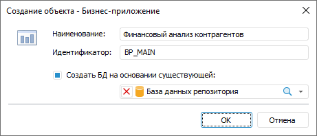
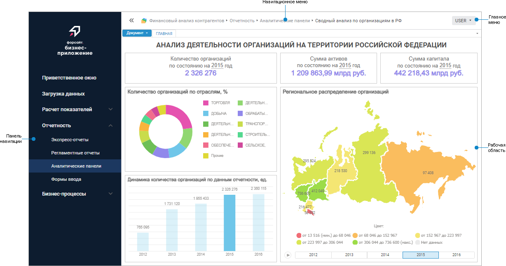
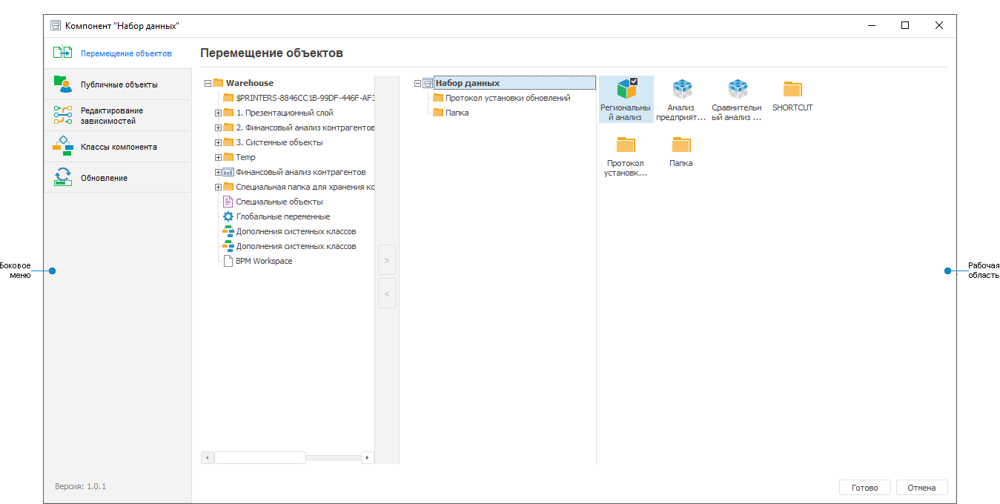

# Начало работы с расширением «Конструктор бизнес-приложений»

Начало работы с расширением «Конструктор бизнес-приложений»
-

# Начало работы с расширением «Конструктор бизнес-приложений»

Для первоначальной установки расширения обратитесь к разделу «[Установка
 расширений в репозиторий](Setup.chm::/Extensions/install_extensions_in_repository.htm)».

## Бизнес-приложение

Для начала работы с бизнес-приложением создайте новое или откройте готовое
 бизнес-приложение.

[Создание
 нового бизнес-приложения](javascript:TextPopup(this))

	Для создания нового бизнес-приложения в [навигаторе
	 объектов](GetStarted.chm::/Interface/Interface_Navigator.htm):

		- в веб-приложении нажмите кнопку  «Создать» в главном меню и выберите
		 тип объекта на боковой панели «[Новый объект](UiNav.chm::/02_Navigator/General_Principles_of_Work.htm#add_object)»;

		- в настольном приложении выполните одно из действий:

			- нажмите кнопку «Новый
			 объект > Пользовательские объекты > Бизнес-приложение»
			 в группе «Создать»
			 на вкладке «Главная»
			 ленты инструментов;

			- выполните команду «Создать
			 > Пользовательские объекты > Бизнес-приложение»
			 в контекстном меню навигатора объектов.

	После выполнения одного из действий:

		- в веб-приложении будет открыт [мастер
		 создания бизнес-приложения](../Web/General_Principles_Web.htm). При создании бизнес-приложения
		 доступна только одна страница мастера - «[Базовые настройки](../Web/Setting_Business_Application.htm)»;

		- в настольном приложении будет открыто окно «Создание
		 объекта – Бизнес-приложение»:

	

	Задайте базовые свойства бизнес-приложения,
	 аналогичные свойствам в мастере создания бизнес-приложения на странице
	 «[Базовые
	 настройки](../Web/Setting_Business_Application.htm)» в веб-приложении. После чего будет открыт [конструктор бизнес-приложений](../Desktop/General_Principles.htm).

[Открытие
 готового бизнес-приложения](javascript:TextPopup(this))

	Для открытия готового бизнес-приложения на редактирование в [навигаторе
	 объектов](GetStarted.chm::/Interface/Interface_Navigator.htm) выделите бизнес-приложение и выполните
	 одно из действий:

		- в веб-приложении:

			- выполните команду «Редактировать»
			 в контекстном меню бизнес-приложения;

			- выполните команду «Редактировать
			 в новой вкладке» в контекстном меню бизнес-приложения;

			- выполните команду «Редактировать
			 в новом окне» в контекстном меню бизнес-приложения;

			- нажмите клавишу F4;

		- в настольном приложении:

			- нажмите кнопку 
			 «Редактировать» в
			 группе «Открыть» на
			 вкладке «Главная»
			 ленты инструментов;

			- выполните команду «Редактировать»
			 в контекстном меню бизнес-приложения;

			- нажмите клавишу F4.

	После выполнения одного из действий:

		- в веб-приложении будет открыт [мастер
		 создания бизнес-приложения](../Web/General_Principles_Web.htm);

		- в настольном приложении будет открыт [конструктор
		 бизнес-приложения](../Desktop/General_Principles.htm).

	Для открытия готового бизнес-приложения на просмотр в [навигаторе
	 объектов](GetStarted.chm::/Interface/Interface_Navigator.htm) выделите бизнес-приложение и выполните
	 одно из действий:

		- в веб-приложении:

			- выполните команду «Открыть»
			 в контекстном меню бизнес-приложения;

			- выполните команду «Открыть
			 в новой вкладке» в контекстном меню бизнес-приложения;

			- выполните команду «Открыть
			 в новом окне» в контекстном меню бизнес-приложения;

			- дважды щёлкните по бизнес-приложению;

			- нажмите клавишу ENTER;

		- в настольном приложении:

			- нажмите кнопку  «Открыть»
			 в группе «Открыть»
			 на вкладке «Главная»
			 ленты инструментов;

			- выполните команду «Открыть»
			 в контекстном меню бизнес-приложения.

	После выполнения одного из действий:

		- в веб-приложении бизнес-приложение будет открыто в дереве
		 объектов навигатора;

		- в настольном приложении бизнес-приложение будет открыто
		 на отдельной вкладке навигатора. Уровень папок ограничен уровнем
		 бизнес-приложения, папка с бизнес-приложением является корневой.

	Для открытия готового бизнес-приложения в веб-интерфейсе обратитесь
	 к разделу «[Открытие
	 бизнес-приложения](Setup.chm::/Extensions/Open_Business_Application.htm)».

	Примечание.
	 Для открытия бизнес-приложения в веб-интерфейсе убедитесь, что выполнена
	 [установка
	 и настройка серверной части конструктора бизнес-приложений](setup.chm::/Extensions/Backend_Designer_of_Business_Applications.htm).

Для построения бизнес-приложения
 в веб-приложении смотрите статью «[Построение
 бизнес-приложения в веб-приложении](../Web/General_Principles_Web.htm)».

Для построения бизнес-приложения
 в настольном приложении смотрите статью «[Построение бизнес-приложения
 в настольном приложении](../Desktop/General_Principles.htm)».

Совет.
 Рекомендуется выполнять построение бизнес-приложения в рамках одного приложения:
 либо в веб-приложении, либо в настольном приложении.

Для работы с готовым бизнес-приложением
 смотрите статью «[Работа
 с готовым бизнес-приложением](../Work/Work_business_application.htm)».

Вид бизнес-приложения в веб-интерфейсе зависит от способа установки
 [серверной
 части конструктора бизнес-приложений](setup.chm::/Extensions/Backend_Designer_of_Business_Applications.htm).

	 Бизнес-приложение 10.x Бизнес-приложение 9.x

		Бизнес-приложение отображается в соответствии с веб-интерфейсом
		 продукта «Форсайт. Аналитическая платформа»
		 версии 10.0 и выше, если серверная часть конструктора бизнес-приложений
		 установлена автоматически на веб-сервер Apache2 в ОС Linux или
		 вручную на IIS в ОС Windows:

		

		Бизнес-приложение отображается в соответствии с веб-интерфейсом
		 продукта «Форсайт. Аналитическая платформа»
		 версии 9.9 и ниже, если серверная часть конструктора бизнес-приложений
		 установлена вручную на веб-сервер Apache2 в ОС Linux, Java в ОС
		 Linux/Windows или автоматически на IIS в ОС Windows:

		

[Элементы
 бизнес-приложения](javascript:TextPopup(this))

		- Панель заголовка.
		 Содержит пользовательский заголовок бизнес-приложения, если для
		 него [настроено оформление](../Desktop/Layout_and_design.htm).
		 По умолчанию не отображается. Доступна только в бизнес-приложении
		 9.x;

		- Панель навигации.
		 Содержит элементы меню бизнес-приложения;

		- Главное меню. Содержит
		 учётные данные пользователя и сервисные команды:

			- [открытие
			 справочной системы на продукт «Форсайт. Аналитическая платформа»](../Work/Work_business_application.htm#open_help);

			- [получение
			 информации о программе](../Work/Work_business_application.htm#about_program). Доступно только в бизнес-приложении
			 10.x;

			- [смена
			 пароля пользователя](../Work/Work_business_application.htm#change_password);

			- [выход
			 из бизнес-приложения](../Work/Work_business_application.htm#exit).

	Если на рабочей области отображается
	 навигатор объектов, то доступно выполнение следующих операций:

			- [обновление
			 списка объектов](../Work/Work_business_application.htm#update). Доступно только в бизнес-приложении 10.x;

			- [открытие
			 объекта на просмотр](../Work/Work_business_application.htm#open_object);

			- [управление
			 отображением объектов](../Work/Work_business_application.htm#view);

			- [увеличение
			 рабочей области](../Work/Work_business_application.htm#work_area);

			- [навигация
			 по объектам](../Work/Work_business_application.htm#navigation).

		- Навигационное меню.
		 Содержит путь от стартовой страницы до папки или объекта, открытого
		 в данный момент, и позволяет управлять отображением панели навигации
		 с помощью кнопок  «Свернуть
		 панель»,  «Развернуть
		 панель»;

		- Рабочая область.
		 Предназначена для отображения и открытия объектов, выбранных на
		 панели навигации.

[Особенности
 отображения элементов](javascript:TextPopup(this))

	Для объектов, открытых с помощью [пользовательских
	 кнопок](DataEntryForms.chm::/Desktop/Custom_module/Advanced.htm) из [формы
	 ввода](DataEntryForms.chm::/Desktop/DataEntryForms_Purpose.htm),
	 недоступна панель навигации и навигационное меню при выполнении следующих
	 условий:

		- объект открывается в [модальном окне](DataEntryForms.chm::/Desktop/Custom_module/Advanced.htm#setting_for_object_opening).
		 Для объекта установлен флажок «[Открывать
		 в модальном окне](DataEntryForms.chm::/Desktop/Custom_module/Advanced.htm#setting_for_object_opening)» при настройке [пользовательской
		 кнопки](DataEntryForms.chm::/Desktop/Custom_module/Advanced.htm) в форме ввода;

		- объект или папка, в которой содержится объект, не отображаются
		 на панели навигации. Для объекта или папки выбран способ отображения
		 «[Не
		 отображать](../Web/Setting_Navigation_Structure.htm#view)» при [настройке
		 структуры навигации](../Web/Setting_Navigation_Structure.htm);

		- объект или папка, в которой содержится объект, расположены
		 вне конструктора бизнес-приложений.

## Компонент

Примечание.
 Работа с компонентом доступна только в настольном приложении.

Для начала работы с компонентом создайте новый или откройте готовый
 компонент.

Открытие готового компонента возможно на отдельной вкладке системного
 [навигатора
 объектов](GetStarted.chm::/Interface/Interface_Navigator.htm) и в конструкторе компонентов.

[Создание
 нового компонента](javascript:TextPopup(this))

	Для создания нового компонента в [навигаторе
	 объектов](GetStarted.chm::/Interface/Interface_Navigator.htm) выполните одно из действий:

		- нажмите кнопку «Новый объект
		 > Пользовательские объекты > Компонент» в группе
		 «Создать» на вкладке «Главная» ленты инструментов;

		- выполните команду «Создать
		 > Пользовательские объекты > Компонент» в контекстном
		 меню навигатора объектов.

	После выполнения одного из действий будет открыто окно «Создание
	 объекта - Компонент». Введите наименование создаваемого компонента
	 и измените автоматически сформированный идентификатор при необходимости.

	Созданный компонент будет открыт на редактирование.

[Открытие готового
 компонента](javascript:TextPopup(this))

	Для открытия готового компонента на просмотр в отдельной вкладке
	 системного [навигатора
	 объектов](GetStarted.chm::/Interface/Interface_Navigator.htm) выделите компонент и выполните одно из
	 действий:

		- нажмите кнопку  «Открыть»
		 или «Открыть > В инструменте
		 по умолчанию» в группе «Открыть»
		 на вкладке «Главная» ленты
		 инструментов;

		- выполните команду «Открыть»
		 в контекстном меню компонента;

		- дважды щёлкните по выбранному компоненту в дереве папок
		 навигатора объектов.

	В режиме просмотра компонента на отдельной вкладке системного навигатора
	 уровень папок ограничен уровнем компонента, то есть папка с компонентом
	 является корневой.

	Для открытия готового компонента на редактирование выделите компонент
	 и выполните одно из действий:

		- нажмите кнопку 
		 «Редактировать» в группе
		 «Открыть» на вкладке «Главная» ленты инструментов;

		- выполните команду «Редактировать»
		 в контекстном меню компонента;

		- нажмите клавишу F4.

	После выполнения одного из действий будет открыт [конструктор
	 компонентов](Component_interface.htm#component).

Для работы с компонентом смотрите
 статью «[Объединение
 функциональности в компоненты](../Component/Basic_properties_of_component.htm)».

Окно конструктора компонентов имеет интерфейс аналогичный конструктору
 бизнес-приложения:

[Элементы окна
 конструктора компонентов](javascript:TextPopup(this))

	Боковое меню конструктора компонентов содержит пункты:

		- Перемещение объектов.
		 Содержит иерархическую структуру папок репозитория и компонента
		 и позволяет переместить объекты из репозитория в компонент и обратно;

		- Публичные объекты.
		 Содержит иерархическую структуру всех объектов компонента и позволяет
		 указать общие объекты, которые могут использоваться в различных
		 приложениях;

		- Редактирование зависимостей.
		 Содержит перечень необходимых компонентов продукта «Форсайт. Аналитическая платформа»
		 для стабильной работы компонента;

		- Классы компонента.
		 Содержит перечень классов объектов, которые относятся к данному
		 компоненту и будут добавлены в репозиторий после установки компонента;

		- Обновление. Содержит
		 функциональность формирования и установки обновлений версий бизнес-компонента.

	Рабочая область предназначена для отображения функциональности для
	 работы с объектами в выбранном пункте меню.

Интерфейс компонента, открытого на просмотр на отдельной вкладке системного
 навигатора, аналогичен [навигатору
 объектов](GetStarted.chm::/Interface/Interface_Navigator.htm) продукта «Форсайт. Аналитическая платформа».

Компоненты и бизнес-приложения, созданные пользователями, зависят от
 системного компонента «Конструктор
 бизнес-приложений»
 продукта «Форсайт. Аналитическая платформа»,
 необходимого для обеспечения их стабильной работы при обновлении версий
 компонентов продукта «Форсайт. Аналитическая платформа».

См. также:

[Построение
 бизнес-приложения](../Desktop/General_Principles.htm) | [Объединение
 функциональности в компоненты](../Component/Basic_properties_of_component.htm)

		Справочная
		 система на версию 10.9
		 от 18/08/2025,
		 © ООО «ФОРСАЙТ»,
