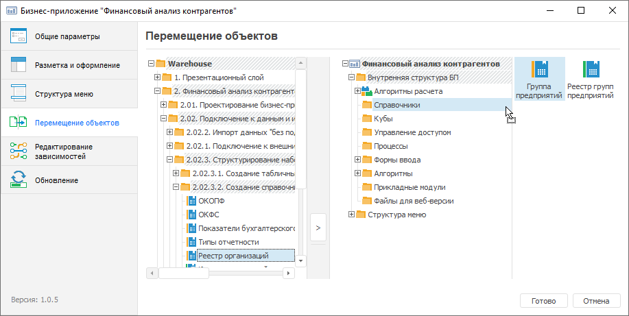

# Создание внутренней структуры: Бизнес-приложение

Создание внутренней структуры: Бизнес-приложение
-

# Создание внутренней структуры

Создание внутренней структуры бизнес-приложения выполняется в папке
 «Внутренняя структура БП», которая
 создаётся по умолчанию при [создании](../Intro/Component_interface.htm#create)
 бизнес-приложения. Папка с внутренней структурой бизнес-приложения предназначена
 для размещения всех пользовательских и служебных объектов приложения:

Важно. Идентификатор
 папки «Внутренняя структура БП»
 задаётся по умолчанию и не должен быть изменён.

Для создания внутренней структуры бизнес-приложения в [навигаторе
 объектов](GetStarted.chm::/Interface/Interface_Navigator.htm):

	- [Откройте](../Intro/Component_interface.htm#open)
	 бизнес-приложение на просмотр.

	- Выберите папку «Внутренняя
	 структура БП» и создайте в ней структуру вложенных [папок](UiNavObj.chm::/UiNavObj_Folder.htm).

	- Добавьте объекты во внутреннюю структуру бизнес-приложения одним
	 из способов:

		- создайте новые объекты в папке «Внутренняя
		 структура БП»;

		- переместите существующие объекты из репозитория в папку
		 «Внутренняя структура БП»
		 с помощью команд контекстного меню «Копировать»,
		 «Вставить» или механизма
		 Drag&Drop;

		- переместите существующие объекты из репозитория в папку
		 «Внутренняя структура БП»
		 с помощью страницы «Перемещение
		 объектов» [конструктора
		 бизнес-приложения](../Desktop/General_Principles.htm) в настольном приложении:

Выделите объекты в области с деревом объектов
 репозитория и переместите их в папку «Внутренняя
 структура БП».

Для перемещения объекта используйте кнопки  и 
 или механизм Drag&Drop. После подтверждения действия объект будет
 перемещён.

Примечание.
 При переносе многофункциональных объектов, например, [аналитических панелей](UIAdhoc.chm::/Launching.htm),
 [экспресс-отчётов](UIExpress.chm::/purpose/UiExpress_Organizational_Starting.htm)
 и других, перенесите во внутреннюю структуру бизнес-приложения все используемые
 в них источники и объекты.

Во внутренней структуре бизнес-приложения могут содержаться следующие
 объекты:

	- [Папка](UiNavObj.chm::/UiNavObj_Folder.htm);

	- [Справочник
	 НСИ](uinavobj.chm::/reference_book/Master_RDS_reference_book/Master_RDS.htm);

	- [Календарный
	 справочник](uinavobj.chm::/reference_book/Master_Calendar_reference_book/Master_Calendar.htm);

	- [Табличный
	 справочник](uinavobj.chm::/reference_book/Master_Table_reference_book/Master_Table.htm);

	- [Вычисляемый
	 справочник](uinavobj.chm::/reference_book/Master_Calculation_reference_book/Master_Calculation.htm);

	- [Стандартный
	 куб](uinavobj.chm::/Cube/CreateCube/Master_Standart/UiMd_Cube_CreateCube_Master_Standart.htm);

	- [Представление
	 куб](uinavobj.chm::/Cube/CreateCube/Master_Conception/UiMd_Cube_CreateCube_Master_Conception.htm);

	- [Виртуальный
	 куб](uinavobj.chm::/Cube/CreateCube/Master_Virtual_Cube/UiMd_Cube_CreateCube_Master_Virtual.htm);

	- [Вычисляемый
	 куб](uinavobj.chm::/Cube/CreateCube/Master_Calculation/UiMd_Cube_CreateCube_Master_Calculation.htm);

	- [Форма
	 ввода/вывода](dataentryforms.chm::/DataEntryForms_Purpose.htm);

	- [Регламентный
	 отчёт](uireport.chm::/UiReport_purpose.htm);

	- [Экспресс-отчёт](uiexpress.chm::/purpose/UiExpress_Purpose.htm);

	- [Аналитическая
	 панель](uiadhoc.chm::/UiAdhoc_Purpose.htm);

	- [Информационная
	 панель](UiDashboard.chm::/InformationPanel/Starting.htm). Доступна только в веб-приложении;

	- [Процесс](bpm.chm::/Modeling_of_business_processes.htm);

	- [Алгоритм
	 расчёта показателей](calculationalgorithm.chm::/Purpose.htm);

	- [Веб-форма](uidevenv.chm::/01_Development_Environment/02_Work_in_Development_Environment/DevEnv_Object/Web_Form.htm).
	 Доступна только в веб-приложении;

	- [Задача
	 ETL](uietl.chm::/Desktop/01_General_Info/UiETL_General.htm);

	- [Рабочее
	 пространство](uiwsp.chm::/1_intro/UiWsp_Intro.htm).

После создания внутренней структуры [откройте](../Intro/Component_interface.htm#open)
 бизнес-приложение на редактирование и [настройте
 отображение панелей](Layout_and_design_web.htm).

См. также:

[Построение
 бизнес-приложения в веб-приложении](General_Principles_Web.htm) | [Построение
 бизнес-приложения в настольном приложении](../Desktop/General_Principles.htm) | [Настройка
 разметки и оформления](Layout_and_design_web.htm)

		Справочная
		 система на версию 10.9
		 от 18/08/2025,
		 © ООО «ФОРСАЙТ»,
