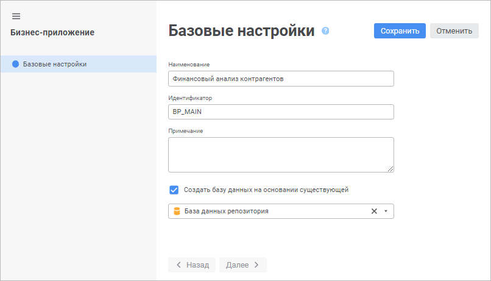

# Построение бизнес-приложения в веб-приложении

Построение бизнес-приложения в веб-приложении
-

# Построение бизнес-приложения в
 веб-приложении

Построение бизнес-приложения выполняется с помощью мастера создания
 бизнес-приложения. Для открытия мастера [создайте](../Intro/Component_interface.htm#create)
 новое или [откройте](../Intro/Component_interface.htm#open)
 готовое бизнес-приложение на редактирование:

Примечание.
 При создании бизнес-приложения доступна только одна страница мастера -
 «[Базовые
 настройки](Setting_Business_Application.htm)». При открытии бизнес-приложения на редактирование
 доступны все страницы мастера: «[Базовые
 настройки](Setting_Business_Application.htm)», «[Разметка
 и оформление](Layout_and_design_web.htm)», «[Структура
 навигации](Setting_Navigation_Structure.htm)», «[Дополнительные
 настройки](Select_Starting_Object_and_Event_Handler.htm)».

Для построения бизнес-приложения:

	- [Настройте базовые
	 свойства](Setting_Business_Application.htm).

	- [Создайте
	 внутреннюю структуру в навигаторе объектов](Create_Internal_Structure_Business_Application.htm).

	- [Настройте разметку и оформление](Layout_and_design_web.htm).

	- [Настройте структуру
	 навигации](Setting_Navigation_Structure.htm).

	- [Выберите
	 стартовый объект и обработчик событий](Select_Starting_Object_and_Event_Handler.htm).

Для расширения возможностей кастомизации бизнес-приложения доступны
 события, которые можно использовать в пользовательских функциях. Подробнее
 о создании функций и событиях смотри статью «[Подключение пользовательской
 js-функции](dhtmlFAQ.chm::/FAQ/js_to_link.htm)».

См. также:

[Начало
 работы с расширением «Конструктор бизнес-приложений»](../Intro/Component_interface.htm) | [Настройка
 базовых свойств](Setting_Business_Application.htm) | [Создание
 внутренней структуры](Create_Internal_Structure_Business_Application.htm) | [Настройка
 разметки и оформления](Layout_and_design_web.htm) | [Настройка
 структуры навигации](Setting_Navigation_Structure.htm) | [Выбор
 стартового объекта и обработчика событий](Select_Starting_Object_and_Event_Handler.htm)

		Справочная
		 система на версию 10.9
		 от 18/08/2025,
		 © ООО «ФОРСАЙТ»,
