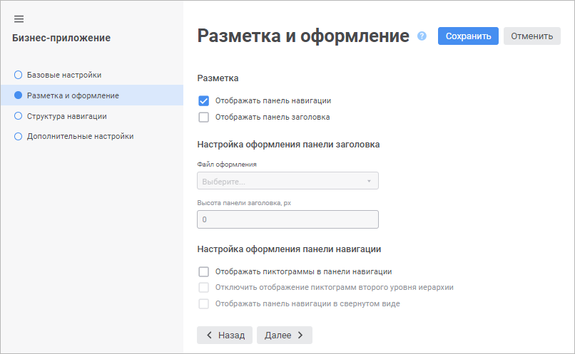

# Настройка разметки и оформления: Бизнес-приложение, веб-приложение

Настройка разметки и оформления: Бизнес-приложение, веб-приложение
-

# Настройка разметки и оформления

Настройка разметки и оформления бизнес-приложения выполняется на странице
 «Разметка и оформление» в [мастере
 создания бизнес-приложения](General_Principles_Web.htm).

[Для открытия
 мастера](javascript:TextPopup(this))

	Для открытия мастера создания бизнес-приложения выделите готовое
	 бизнес-приложение в [навигаторе
	 объектов](GetStarted.chm::/Interface/Interface_Navigator.htm) и откройте его на редактирование:

	- выполните команду «Редактировать»
	 в контекстном меню бизнес-приложения;

	- выполните команду «Редактировать
	 в новой вкладке» в контекстном меню бизнес-приложения;

	- выполните команду «Редактировать
	 в новом окне» в контекстном меню бизнес-приложения;

	- нажмите клавишу F4.

Задайте параметры в разделах:

	- Разметка. Настройте
	 отображение панели навигации и панели заголовка в бизнес-приложении:

		- Отображать панель навигации.
		 По умолчанию флажок установлен;

		- Отображать панель заголовка.
		 По умолчанию флажок снят. Панель заголовка доступна только в ОС
		 Windows;

	- Настройка оформления панели
	 заголовка. Актуальна для работы с бизнес-приложением в ОС Windows;

Совет.
 Рекомендуется настраивать оформление панели заголовка в [настольном
 приложении](../Desktop/Layout_and_design.htm).

	- Настройка оформления панели
	 навигации. Настройте отображение элементов меню на панели навигации
	 с помощью флажков:

		- Отображать
		 пиктограммы в панели навигации. Установите флажок для загрузки
		 и отображения пиктограмм элементов меню на панели навигации. При
		 изменении состояния флажка выводится информационное окно с сообщением
		 об изменении режима отображения панели навигации и с рекомендацией
		 о проверке актуальности подключённых файлов стилей. Проверка актуальна
		 только в ОС Windows. По умолчанию флажок снят.

При установленном флажке доступна загрузка
 пиктограмм для каждого элемента меню на вкладке «[Оформление](Setting_Navigation_Structure.htm#design)»
 страницы «Структура навигации».
 Пиктограммы могут загружаться только для элементов меню первого и второго
 уровней структуры навигации. Если для элемента не загружена пользовательская
 пиктограмма, то будет отображаться [пиктограмма
 по умолчанию](Setting_Navigation_Structure.htm#design);

		- Отключить
		 отображение пиктограмм второго уровня иерархии. Установите
		 флажок для отображения пиктограмм элементов меню, расположенных
		 только на первом уровне структуры навигации. По умолчанию флажок
		 снят и доступен при установленном флажке «Отображать
		 пиктограммы в панели навигации»;

		- Отображать панель навигации
		 в свёрнутом виде. Установите флажок для скрытия панели
		 навигации при [открытии](../Intro/Component_interface.htm#open)
		 бизнес-приложения в веб-интерфейсе. В свёрнутом виде на панели
		 навигации отображаются только [пиктограммы](Setting_Navigation_Structure.htm#design)
		 элементов меню первого уровня. Для управления отображением панели навигации используйте
		 кнопки  «Развернуть
		 панель»,  «Свернуть
		 панель» в навигационном меню. По умолчанию флажок снят
		 и доступен при установленном флажке «Отображать
		 пиктограммы в панели навигации».

Для доступа к элементам меню второго уровня
 при свёрнутой панели навигации наведите курсор на пиктограмму требуемого
 элемента первого уровня, после чего появится всплывающая панель с его
 дочерними элементами. Отображение пиктограмм элементов второго уровня
 на всплывающей панели зависит от состояния флажка «Отключить
 отображение пиктограмм второго уровня иерархии».

Примечание.
 Настройка оформления панели навигации доступна, если установлен флажок
 «Отображать панель навигации».

Для сохранения заданных настроек нажмите кнопку «Сохранить».

После настройки разметки и оформления бизнес-приложения перейдите к
 [настройке структуры навигации](Setting_Navigation_Structure.htm).

См. также:

[Построение
 бизнес-приложения в веб-приложении](General_Principles_Web.htm) | [Настройка
 структуры навигации](Setting_Navigation_Structure.htm)

		Справочная
		 система на версию 10.9
		 от 18/08/2025,
		 © ООО «ФОРСАЙТ»,
