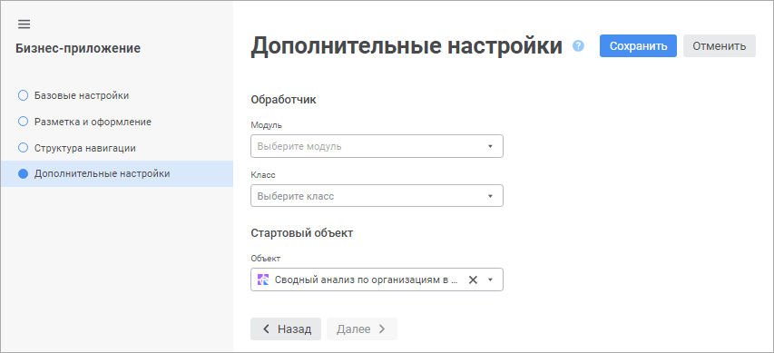

# Выбор стартового объекта и обработчика событий: Бизнес-приложение, веб-приложение

Выбор стартового объекта и обработчика событий: Бизнес-приложение, веб-приложение
-

# Выбор стартового объекта и обработчика событий

Выбор стартового объекта и обработчика событий выполняется на странице
 «Дополнительные настройки» в [мастере создания бизнес-приложения](General_Principles_Web.htm).

[Для открытия
 мастера](javascript:TextPopup(this))

	Для открытия мастера создания бизнес-приложения выделите готовое
	 бизнес-приложение в [навигаторе
	 объектов](GetStarted.chm::/Interface/Interface_Navigator.htm) и откройте его на редактирование:

	- выполните команду «Редактировать»
	 в контекстном меню бизнес-приложения;

	- выполните команду «Редактировать
	 в новой вкладке» в контекстном меню бизнес-приложения;

	- выполните команду «Редактировать
	 в новом окне» в контекстном меню бизнес-приложения;

	- нажмите клавишу F4.

Задайте параметры в разделах:

	- Обработчик. Настройте
	 обработчик событий:

		- Модуль. Выберите
		 в раскрывающемся списке модуль, написанный на языке Fore, для
		 выполнения действия при наступлении определенного события. Например,
		 при наступлении определённого события необходимо выводить информационное
		 сообщение. Модуль обрабатывается при открытии бизнес-приложения
		 и разрабатывается под потребности конкретного прикладного проекта
		 для расширения его функциональных возможностей. Модуль должен
		 быть предварительно создан и добавлен во [внутреннюю
		 структуру бизнес-приложения](Create_Internal_Structure_Business_Application.htm).

Пример модуля:

	Public Class BusinessApplicationEvents1: BusinessApplicationEvents

	    Public Sub OnAfterLogin(BP_IDENT: string);

	    Begin

	        Debug.WriteLine("OnAfterLogin");

	    End Sub OnAfterLogin;

	End Class BusinessApplicationEvents1;

		- Класс.
		 Выберите в раскрывающемся списке класс, наследуемый от класса
		 BusinessApplicationEvents и реализующий его события. Задаётся
		 прикладным разработчиком в модуле Fore.

Примечание.
 Обработка событий может настраиваться для различных объектов, например,
 в [регламентных
 отчётах](UiReport.chm::/desktop/Reports/Event/UiReport_Reports_Event.htm).

	- Стартовый объект. Выберите
	 в раскрывающемся списке «Объект»
	 ярлык на объект из [структуры
	 навигации](Setting_Navigation_Structure.htm), содержимое которого будет отображаться при открытии
	 бизнес-приложения в веб-интерфейсе. В качестве стартового объекта
	 может использоваться:

		- [Регламентный
		 отчёт](uireport.chm::/UiReport_purpose.htm);

		- [Экспресс-отчёт](uiexpress.chm::/purpose/UiExpress_Purpose.htm);

		- [Аналитическая
		 панель](uiadhoc.chm::/UiAdhoc_Purpose.htm);

		- [веб-форма](uidevenv.chm::/01_Development_Environment/02_Work_in_Development_Environment/DevEnv_Object/Web_Form.htm).

Для быстрого выбора объекта в списках «Модуль» и «Объект»
 введите  поле для поиска  его название/идентификатор/ключ, в
 зависимости от настроек отображения. Поиск будет выполняться автоматически
 по мере ввода текста. В списке будут отображаться только те объекты, наименования/идентификаторы/ключи
 которых содержат вводимый текст.

Для настройки отображения объектов репозитория
 в списках «Модуль» и «Объект»
 нажмите кнопку  «Отображение
 объекта» и выберите в раскрывающемся меню вариант отображения:

	- Наименование. Объекты
	 отображаются под своими наименованиями. Вариант по умолчанию;

	- Идентификатор. Объекты
	 отображаются под своими идентификаторами;

	- Ключ. Объекты отображаются
	 под своими ключами.

Выбрать можно несколько вариантов. Идентификатор и ключ будут указаны
 в скобках.

Для сброса отметки выбранных объектов нажмите
 кнопку 
 «Очистить».

Для сохранения заданных настроек нажмите кнопку «Сохранить».

После выбора стартового объекта и обработчика событий [откройте](../Intro/Component_interface.htm#open)
 бизнес-приложение в веб-интерфейсе.

См. также:

[Построение
 бизнес-приложения в веб-приложении](General_Principles_Web.htm) | [Работа
 с готовым бизнес-приложением](../Work/Work_business_application.htm)

		Справочная
		 система на версию 10.9
		 от 18/08/2025,
		 © ООО «ФОРСАЙТ»,
